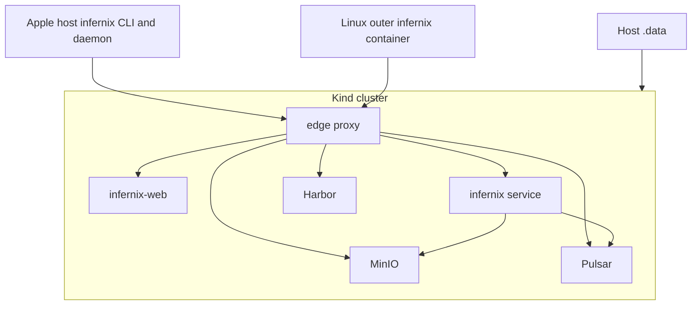

# Infernix Development Plan - Overview

**Status**: Authoritative source
**Referenced by**: [README.md](README.md), [system-components.md](system-components.md)

> **Purpose**: Capture the architecture baseline, hard constraints, control-plane topology, and
> canonical repository shape that every `infernix` phase depends on.

## Current Repo Assessment

The repository currently consists of planning and guidance material, with the implementation tree
to be added by later phases.

| Area | Current state | Gap against target |
|------|---------------|--------------------|
| Development plan | present | implementation phases still open |
| Haskell service | absent | single `infernix` executable not implemented yet |
| Kind and Helm assets | absent | cluster lifecycle and chart topology must be created |
| `documents/` suite | absent | documentation standards and governed docs must be created |
| PureScript web app | absent | manual inference UI and Playwright container path must be created |
| Tests | absent | unit, integration, and E2E suites must be created |

## Target Outcome

`infernix` is a Kind-forward local inference platform that:

- uses one Haskell executable named `infernix` for service runtime, cluster lifecycle, and test orchestration
- uses one Kind cluster as the supported local substrate
- deploys Harbor, MinIO, and Pulsar through Helm with one mandatory local HA topology: 3x Harbor,
  4x MinIO, and 3x Pulsar replicas where the chosen charts expose those replica surfaces
- uses local Harbor as the image source for every cluster pod except Harbor's own bootstrap pods
- deletes default storage classes and relies only on a manual `kubernetes.io/no-provisioner` storage class
- creates PVs manually under `./.data/` and permits PVC creation only through Helm-owned stateful workloads
- serves the PureScript web UI from a cluster-resident webapp service, built as a separate binary
  and container image from `infernix`, in every supported mode
- exposes the UI, API, Harbor, MinIO, and Pulsar browser surfaces through one reverse-proxied localhost edge port
- keeps Haskell types authoritative for frontend contracts and verifies the PureScript side with `purescript-spec`
- enforces Haskell static quality with `fourmolu`, `cabal-fmt`, `hlint`, and strict compiler warnings through `infernix test lint`
- runs Playwright from the same container image that serves the web UI

## Topology Baseline



## Canonical Repository Shape

The repository layout authority moves here from `README.md`. The intended shape at full plan
closure is:

```text
infernix/
├── DEVELOPMENT_PLAN/
├── documents/
│   ├── README.md
│   ├── documentation_standards.md
│   ├── architecture/
│   ├── development/
│   ├── engineering/
│   ├── operations/
│   ├── reference/
│   ├── tools/
│   └── research/
├── infernix.cabal
├── cabal.project
├── app/
│   └── Main.hs
├── src/
│   └── Infernix/
│       ├── CLI/
│       ├── Cluster/
│       ├── Config/
│       ├── Manifest/
│       ├── MinIO/
│       ├── Models/
│       ├── Pulsar/
│       ├── Runtime/
│       ├── Service/
│       ├── Storage/
│       └── Types/
├── proto/
│   └── infernix/
│       ├── api/
│       ├── manifest/
│       └── runtime/
├── web/
│   ├── src/
│   ├── test/
│   ├── playwright/
│   └── Dockerfile
├── chart/
├── kind/
├── docker/
├── test/
│   ├── unit/
│   └── integration/
├── .build/
└── .data/
```

## Hard Constraints

### 0. Documentation-First Construction Rule

Phase 0 creates the governed `documents/` suite and closes before any code-writing phase begins.

- While Phase 0 is open, Phases 1-6 remain blocked.
- The repository README stays an orientation document and does not re-absorb the canonical rules
  that Phase 0 moves into `documents/`.

### 1. Single Haskell Binary

The repo ships one Haskell executable, `infernix`.

- `infernix service` runs the service runtime.
- `infernix cluster ...` owns Kind and Helm lifecycle.
- `infernix test ...` owns validation entrypoints.
- No second repo-owned Haskell executable exists for tests, bootstrap wrappers, or sidecar helpers.

### 2. Dual Control-Plane Modes

The supported local operator surface is platform-sensitive:

- Apple Silicon: `./.build/infernix` runs directly on the host and shells out to host-installed
  `kind`, `kubectl`, `helm`, and Docker.
- Apple Silicon host builds place the compiled binary and other generated build artifacts under
  `./.build/`.
- On Apple Silicon, `cluster up` writes the repo-local kubeconfig to `./.build/infernix.kubeconfig`
  and must not mutate `$HOME/.kube/config` or the user's global current context.
- `infernix kubectl ...` is the supported wrapper for Kubernetes access and automatically targets
  the repo-local kubeconfig under `./.build/`.
- On Apple Silicon, `infernix` may install missing host prerequisites needed by supported local
  runtime flows, including Homebrew-installed `poetry` when absent and other required Python
  dependencies.
- Containerized Linux: `docker compose run --rm infernix infernix ...` is the supported launcher,
  with the Docker socket forwarded and `./.data/` bind mounted.

The distinction is about where `infernix` runs, not whether Kind uses containers. Kind still
depends on Docker in both modes.

### 3. Manual Storage Doctrine

Persistent local state is explicit and deterministic.

- Default storage classes are deleted on cluster bootstrap.
- The only supported storage class is a manual no-provisioner class, tentatively named
  `infernix-manual`.
- Durable PVCs are emitted only by Helm-managed stateful workloads.
- Durable PVs are emitted only by the storage-reconciliation step inside `infernix cluster up`.
- Each durable PV maps into `./.data/kind/<namespace>/<release>/<workload>/<ordinal>/<claim>`.

### 4. Cluster-Resident Webapp Service

The webapp service always runs on the Kind cluster in a container.

- This remains true even when the `infernix` daemon runs host-native on Apple Silicon.
- The browser never depends on a host-only webserver path.
- The stable browser entrypoint is always the edge proxy.
- The webapp is a separate binary from `infernix` and is built through its own `web/Dockerfile`.
- The webapp rollout is owned by a repo Helm chart, not ad hoc Kubernetes manifests.

### 5. Local Harbor Is The Cluster Image Source

Local Harbor is the image authority for cluster workloads.

- Every pod deployed to the Kind cluster pulls from local Harbor.
- The only exception is Harbor's own bootstrap path, which may pull directly from Docker Hub or
  another upstream registry while Harbor is not running yet.
- `infernix cluster up` mirrors required third-party images, builds repo-owned images, including
  the webapp image via `web/Dockerfile`, and publishes them to Harbor before Helm rollout begins.

### 5a. Mandatory Local HA Service Topology

The supported cluster path always deploys the HA service layout.

- Harbor application-plane workloads use three replicas where the chosen chart exposes replicated
  application services.
- MinIO always deploys as a four-node distributed cluster.
- Pulsar durable HA components use three replicas where the chosen chart exposes those HA surfaces.
- Repo-owned Helm values explicitly suppress hard pod anti-affinity and equivalent hard scheduling
  constraints that would otherwise block these replicas from scheduling on local Kind.
- There is no supported single-replica dev profile and no CLI flag that opts out of the mandatory
  local HA topology.

### 6. Stable Edge Port and Route Prefixes

All browser-visible and host-consumed cluster portals share one loopback port chosen by the CLI.

- The CLI chooses an available localhost port during cluster startup.
- The chosen port is recorded under `./.data/` and surfaced by `infernix cluster status`.
- At minimum, the edge exposes `/`, `/api`, `/harbor`, `/minio/console`, `/minio/s3`,
  `/pulsar/admin`, and `/pulsar/ws`.
- Apple host-native `infernix` reaches MinIO and Pulsar through these reverse-proxied edge routes.

### 6a. `cluster up` Is A Test-Cluster Bring-Up Flow

The supported `cluster up` flow exists to provision the test cluster used by repository validation
workflows.

- `cluster up` auto-generates the Dhall configuration needed for supported test flows.
- `cluster up` also writes the repo-local kubeconfig used by supported `infernix kubectl` flows.
- The generated configuration enables all models appropriate for the active mode under test.
- The generated Dhall file is a build artifact, not tracked source, and lives in the build-output
  location for the active execution context.

### 7. Haskell Types Own Frontend Contracts

Haskell ADTs are the SSOT for the frontend contract.

- The webapp image build generates the frontend contract from Haskell-owned types during
  `web/Dockerfile` execution.
- The PureScript application does not maintain hand-authored duplicate request or response DTOs.
- No standalone `infernix codegen purescript` command exists.
- `purescript-spec` proves the frontend stays aligned with the Haskell-owned contract.

### 8. Playwright Lives With the Web Image

Playwright is installed in the same container image that serves the web UI.

- Chromium, WebKit, and Firefox are provisioned there.
- `infernix test e2e` runs from that image, not from the host and not from a separate ad hoc test image.

### 8a. Haskell Formatting, Linting, and Warning Policy

Haskell source quality is validated explicitly.

- `infernix test lint` is the canonical static-quality entrypoint.
- `fourmolu` formats repo-owned Haskell source.
- `cabal-fmt` formats `.cabal` and `cabal.project` files.
- `hlint` provides lint and simplification checks.
- Repo-owned validation uses strict compiler warnings and treats warnings as errors.
- No competing Haskell formatter is introduced.

### 9. Container Build Output Stays Under `/opt/build`

Containerized builds keep generated artifacts out of the bind-mounted repo tree.

- The repo-owned `cabal.project` governs default host-native Cabal behavior, but Dockerfiles and
  supported outer-container `cabal` invocations still pass `--builddir=/opt/build/infernix`
  explicitly so container artifacts land under `/opt/build/infernix`.
- Supported container Cabal workflows use `/opt/build/infernix` as the build root.
- Unqualified bare `cabal` invocations are not allowed to recreate `dist-newstyle/` or any other
  build output under the mounted repository during supported container workflows.
- The repo-owned CLI, container entrypoint contract, or wrapper layer must enforce this behavior
  rather than relying on contributor discipline alone.

### 10. Apple Host Build Output Stays Under `./.build`

Apple host-native builds keep generated artifacts under the repo-local `./.build/` directory.

- The repo contains a repo-owned `cabal.project` that encodes the default host-native Cabal build
  doctrine, including build output under `./.build/`.
- Supported Apple host-native bare `cabal build`, `cabal test`, and target-specific Cabal
  invocations inherit those defaults without requiring a host-side `--builddir` flag on the command
  line.
- Supported Apple host-native command examples use `./.build/infernix ...`.
- The generated test Dhall configuration for host-side `cluster up` lives under `./.build/`.
- The Apple host-native kubeconfig for supported cluster access lives at `./.build/infernix.kubeconfig`.
- `./.build/` is ignored by Git and excluded from Docker build context.

## Command Surface Baseline

The canonical supported CLI surface is:

| Command | Contract |
|---------|----------|
| `infernix service` | long-running daemon entrypoint for the Haskell service; the only supported command family that is not idempotent by design |
| `infernix cluster up` | declaratively reconcile the supported cluster, mandatory local HA topology, manual storage, Harbor-backed images, Helm workloads, and generated test config to the requested target state |
| `infernix cluster down` | declaratively reconcile cluster absence while preserving authoritative repo data under `./.data/` |
| `infernix cluster status` | read-only status and route report; never mutates cluster or repo state |
| `infernix kubectl ...` | `kubectl` wrapper that automatically targets the repo-local kubeconfig in the active build-output location |
| `infernix test lint` | declaratively execute Haskell formatting, lint, and compiler-warning checks |
| `infernix test unit` | declaratively execute unit validation |
| `infernix test integration` | declaratively execute integration validation, reusing or reconciling supported prerequisites as needed |
| `infernix test e2e` | declaratively execute Playwright validation from the web image |
| `infernix test all` | declaratively execute the full supported validation matrix, aggregating lint, unit, integration, and E2E checks |
| `infernix docs check` | declaratively validate the documentation suite and development-plan cross-references |

Every supported lifecycle, validation, and docs command except `infernix service` is declarative
and idempotent. `infernix kubectl ...` is a scoped wrapper around upstream `kubectl`, not a
parallel lifecycle command family. The plan does not introduce alternate imperative helper command
families for storage, image preparation, or test setup.

## Completion Rules

- A phase is complete only when the target behavior exists and the listed validation gates pass.
- The README does not become the architecture source again for repository layout once this plan exists.
- When topology changes, update [README.md](README.md), [system-components.md](system-components.md),
  and the owning phase file together.

## Cross-References

- [README.md](README.md)
- [system-components.md](system-components.md)
- [phase-0-documentation-and-governance.md](phase-0-documentation-and-governance.md)
- [phase-1-repository-and-control-plane-foundation.md](phase-1-repository-and-control-plane-foundation.md)
- [phase-2-kind-cluster-storage-and-lifecycle.md](phase-2-kind-cluster-storage-and-lifecycle.md)
- [phase-3-ha-platform-services-and-edge-routing.md](phase-3-ha-platform-services-and-edge-routing.md)
- [phase-4-inference-service-and-durable-runtime.md](phase-4-inference-service-and-durable-runtime.md)
- [phase-5-web-ui-and-shared-types.md](phase-5-web-ui-and-shared-types.md)
- [phase-6-validation-e2e-and-ha-hardening.md](phase-6-validation-e2e-and-ha-hardening.md)
