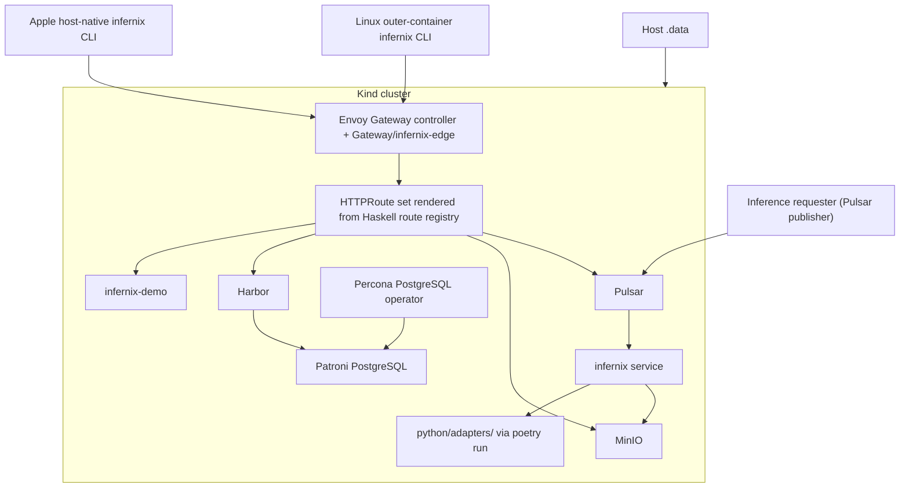

# Infernix Development Plan - Overview

**Status**: Authoritative source
**Referenced by**: [README.md](README.md), [system-components.md](system-components.md)

> **Purpose**: Capture the architecture baseline, hard constraints, control-plane topology,
> runtime-mode contract, and canonical repository shape that every `infernix` phase depends on.

## Current Repo Assessment

The supported architecture now matches the tightened DRY model. The table below separates the
supported contract from the current validation state.

| Area | Supported contract | Current repo gap |
|------|--------------------|------------------|
| Root-document governance | `README.md` is orientation only; `documents/` owns canonical topic docs; `AGENTS.md` and `CLAUDE.md` are thin governed entry documents | no material governed-root-document gap remains in the worktree |
| CLI ownership | one structured Haskell command registry owns supported command parsing, help text, and the generated canonical CLI reference sections | no material CLI-ownership gap remains in the worktree |
| Shared workflow helpers | one Haskell helper module owns web dependency readiness, platform-command availability checks, and shared generated-file banner constants | no material shared-workflow-helper gap remains in the worktree |
| Control-plane execution | Apple host-native control plane plus Linux outer-container control plane | the worktree contains the Apple host-native path, the `linux-cpu` outer-container launcher, and the supported direct `linux-cuda` launcher; no material control-plane implementation gap remains outside the separate clean-host bootstrap follow-on |
| Host prerequisite minimization | Apple requires only Homebrew plus ghcup before building `infernix`; Colima is the only supported Apple Docker environment; `linux-cpu` requires only Docker; `linux-cuda` adds only the NVIDIA Docker prerequisites; `infernix` reconciles every remaining supported host tool through package managers | no material host-prerequisite gap remains in the worktree |
| Runtime honesty | one host-native Apple inference lane plus two Linux substrate images | no material runtime-honesty gap remains in the governed docs or current worktree |
| Linux image layout | one shared `docker/linux-substrate.Dockerfile` builds `infernix-linux-cpu` and `infernix-linux-cuda` | the shared image and source-snapshot manifest are landed, and no material Linux-image implementation gap remains in the worktree |
| Pulsar production transport | `src/Infernix/Runtime/Pulsar.hs` uses Pulsar WebSocket and admin surfaces when configured, with filesystem simulation only as the fallback path | no material transport gap remains in the worktree |
| Python adapter boundary | one `python/pyproject.toml` and one `python/adapters/` tree | the shared project is landed; the current validated adapter contract consumes durable bundle or manifest metadata plus idempotent setup manifests to produce deterministic engine-family-specific worker output, and no material repository-shape gap remains in the worktree |
| Browser-contract ownership | handwritten Haskell contract ADTs live outside any `Generated/` directory; only emitted PureScript stays under `web/src/Generated/` | no material browser-contract ownership gap remains in the worktree |
| Route or publication contract | one Haskell route registry drives rendered HTTPRoutes, publication state, chart lint, and docs | no material route or publication gap remains in the worktree |
| Generated deployment inputs | `chart/values.yaml` holds stable defaults only; generated demo-config and publication payloads are ephemeral inputs | no material generated-input gap remains in the worktree |
| Validation doctrine | one canonical testing doctrine plus one canonical Haskell-style guide describe enforced rules, review guidance, and validation entrypoints | doctrine is landed, and the worktree contains lint, unit, integration, and E2E entrypoints with explicit active-mode catalog coverage and registry-backed docs validation |

## Supported Outcome

`infernix` is a Kind-forward local inference platform that:

- ships two Haskell executables sharing one Cabal library `infernix-lib`: `infernix` for the
  production daemon, cluster lifecycle, validation, and internal helpers; and `infernix-demo` for
  the optional demo HTTP host
- uses one parser-driven Haskell command registry as the source of truth for CLI parsing, help
  text, and the canonical CLI reference
- treats Apple Silicon as a host-native inference lane by design and treats `linux-cpu` plus
  `linux-cuda` as the two containerized Linux runtime lanes
- reduces the intended Apple pre-existing host requirements to Homebrew plus ghcup, treats Colima
  as the only supported Apple Docker environment, and lets `infernix` reconcile the remaining
  Homebrew-managed Apple host tools plus Poetry bootstrap as needed
- uses one Kind cluster as the supported local cluster substrate
- deploys Harbor first through Helm on a pristine cluster, allowing Harbor and only
  Harbor-required support services such as MinIO and PostgreSQL to pull from public registries
  before Harbor is ready
- requires every later non-Harbor workload to pull from Harbor after bootstrap completes
- deploys Harbor, MinIO, Pulsar, and every in-cluster PostgreSQL dependency through one
  Helm-owned cluster path, with PostgreSQL always delivered as Patroni clusters managed by the
  Percona Kubernetes operator
- deletes default StorageClasses and uses only the repo-owned manual `infernix-manual` storage
  class for every PVC-backed workload
- creates PVs manually under `./.data/`, binds them explicitly to named PVCs, and keeps that rule
  for operator-managed PostgreSQL claims as well as direct chart workloads
- serves the demo UI from `infernix-demo`, implemented in PureScript and built with spago, when
  the active generated `.dhall` enables `demo_ui`
- exposes browser-visible surfaces through Envoy Gateway API resources and repo-owned HTTPRoute
  manifests only; the demo cluster is local-only and carries no auth filter
- accepts production inference work by Pulsar subscription only; production `infernix service`
  binds no HTTP listener
- restricts Python to one shared Poetry project under `python/pyproject.toml` and one adapter tree
  under `python/adapters/`; all adapter execution runs through `poetry run`
- keeps Haskell authoritative for frontend contracts through
  `infernix internal generate-purs-contracts`, with handwritten browser-contract ADTs living at
  `src/Infernix/Web/Contracts.hs`
- builds the Linux lanes from one shared `docker/linux-substrate.Dockerfile` that emits the two
  real runtime images `infernix-linux-cpu` and `infernix-linux-cuda`
- uses a Linux outer-container launcher that runs against a baked image snapshot and bind-mounts
  only `./.data/`
- keeps Linux host prerequisites minimal: Docker only for `linux-cpu`, Docker plus the supported
  NVIDIA driver or container-toolkit setup for `linux-cuda`
- keeps generated artifacts out of git, including generated proto stubs, `*.pyc`,
  `__pycache__/`, Poetry lockfiles, `web/spago.lock`, `web/dist/`, and `web/src/Generated/`

## Topology Baseline



## Canonical Repository Shape

The authoritative repository shape closes toward the layout below.
Generated-only paths such as `web/src/Generated/` and `tools/generated_proto/` materialize on
demand and stay untracked even though they are part of the supported shape.

```text
infernix/
├── DEVELOPMENT_PLAN/
├── documents/
│   ├── README.md
│   ├── documentation_standards.md
│   ├── architecture/
│   ├── development/
│   ├── engineering/
│   ├── operations/
│   ├── reference/
│   ├── tools/
│   └── research/
├── AGENTS.md
├── CLAUDE.md
├── README.md
├── Setup.hs
├── compose.yaml
├── infernix.cabal
├── cabal.project
├── app/
│   ├── Main.hs
│   └── Demo.hs
├── src/
│   └── Infernix/
│       ├── CLI.hs
│       ├── CommandRegistry.hs
│       ├── Routes.hs
│       ├── Web/
│       │   └── Contracts.hs
│       ├── Cluster/
│       ├── Demo/
│       ├── Lint/
│       ├── Runtime/
│       ├── Service.hs
│       ├── Storage.hs
│       └── Types.hs
├── proto/
│   └── infernix/
├── python/
│   ├── pyproject.toml
│   └── adapters/
├── web/
│   ├── spago.yaml
│   ├── src/
│   │   ├── *.purs
│   │   └── Generated/
│   ├── test/
│   └── playwright/
├── chart/
│   └── templates/
│       ├── gatewayclass.yaml
│       ├── gateway.yaml
│       ├── httproutes.yaml
│       ├── configmap-demo-catalog.yaml
│       └── configmap-publication-state.yaml
├── kind/
├── docker/
│   └── linux-substrate.Dockerfile
├── tools/
│   └── generated_proto/
├── test/
├── .build/
└── .data/
```

## Execution Contexts and Runtime Modes

The plan keeps control-plane execution context separate from runtime mode.

### Control-Plane Execution Contexts

| Context | Canonical launcher | Purpose |
|---------|--------------------|---------|
| Apple host-native control plane | `./.build/infernix ...` | canonical operator surface on Apple Silicon |
| Linux outer-container control plane | `docker compose run --rm infernix infernix ...` for `linux-cpu`; direct `docker run --gpus all ... infernix-linux-cuda:local infernix ...` for `linux-cuda` | image-snapshot launcher for Linux workflows |

### Runtime Modes

| Runtime mode | Canonical mode id | Engine column from README matrix | Typical role |
|--------------|-------------------|----------------------------------|--------------|
| Apple Silicon / Metal | `apple-silicon` | Best Apple Silicon engine | host-native inference lane |
| Ubuntu 24.04 / CPU | `linux-cpu` | Best Linux CPU engine | containerized Linux CPU lane |
| Ubuntu 24.04 / NVIDIA CUDA Container | `linux-cuda` | Best Linux CUDA engine | containerized Linux GPU lane |

## Hard Constraints

### 0. Documentation-First Construction Rule

- Phase 0 remains the closed bootstrap for governed docs.
- New documentation gaps land as explicit follow-on work in later phases.
- `README.md` stays an orientation layer.
- governed root docs carry explicit status, supersession, and canonical-home markers when they
  distinguish canonical guidance from entry-document summaries
- Canonical topic ownership moves into `documents/`:
  - runtime modes: `documents/architecture/runtime_modes.md`
  - local operator workflow: `documents/development/local_dev.md`
  - route contract: `documents/engineering/edge_routing.md`
  - CLI inventory: `documents/reference/cli_reference.md`
  - Python adapter doctrine: `documents/development/python_policy.md`

### 1. Two Haskell Executables Sharing One Library

- `infernix` and `infernix-demo` are the only supported repo-owned Haskell executables.
- Both link one shared Cabal library `infernix-lib`.
- Tests and helpers do not become extra supported executables.

### 2. Dual Control-Plane Execution Contexts

- Apple host-native control plane is the canonical operator surface.
- Linux outer-container control plane is a convenience launcher around a baked image snapshot.
- Supported Linux launcher docs use `docker compose run --rm infernix infernix ...` for
  `linux-cpu` and direct `docker run --gpus all ... infernix-linux-cuda:local infernix ...` for
  `linux-cuda`.
- Apple host-native `cluster up` writes the repo-local kubeconfig to `./.build/infernix.kubeconfig`.
- Linux outer-container `cluster up` writes the repo-local kubeconfig to
  `./.data/runtime/infernix.kubeconfig` so fresh launcher containers reuse the same durable
  cluster handle.
- `docker compose up` and `docker compose exec` are not supported operator workflows.
- The Linux launcher bind-mounts only `./.data/` once its cleanup sprint closes.

### 3. Three Supported Runtime Modes

- `apple-silicon`, `linux-cpu`, and `linux-cuda` are the canonical runtime-mode ids.
- Runtime mode selects the README matrix column.
- Control-plane execution context and runtime mode remain separate concepts.

### 3a. `linux-cuda` Requires GPU-Enabled Kind

- `linux-cuda` closes only when Kind exposes `nvidia.com/gpu` resources to Kubernetes.
- The CUDA lane uses an in-image `nvkind` toolchain, not a host-visible binary handoff.

### 4. Generated Mode-Specific Demo `.dhall` and ConfigMap Publication

- `cluster up` emits `infernix-demo-<mode>.dhall` for the active runtime mode.
- The generated file is staging content and is published into `ConfigMap/infernix-demo-config`.
- On the Linux outer-container control-plane path, the generated staging file lives under
  `/opt/build/infernix/infernix-demo-<mode>.dhall`.
- Cluster-resident consumers mount that ConfigMap read-only at `/opt/build/`.
- Cluster-resident consumers read the active mode's mounted file from
  `/opt/build/infernix-demo-<mode>.dhall`.
- The mounted file is the exact source of truth for demo-visible catalog entries.

### 5. Manual Storage Doctrine

- All default StorageClasses are deleted during bootstrap.
- `infernix-manual` is the only supported persistent StorageClass.
- PVs are created only by `infernix` lifecycle code and map deterministically into `./.data/`.
- Hand-authored standalone durable PVC manifests are forbidden.

### 5a. Protobuf Manifest and Event Contract

- Repo-owned `.proto` schemas define runtime manifests and Pulsar payloads.
- Haskell uses generated `proto-lens` bindings.
- Python adapters consume matching generated protobuf modules.

### 5b. Operator-Managed PostgreSQL Doctrine

- Every in-cluster PostgreSQL dependency uses Patroni under the Percona Kubernetes operator.
- Charts that can self-deploy PostgreSQL disable that path and point to operator-managed clusters.

### 6. Cluster-Resident Demo UI

- The demo UI is served only by `infernix-demo`.
- When `demo_ui` is false in the active generated `.dhall`, no demo UI or demo API route is
  published.

### 7. Local Harbor Is The Cluster Image Source

- Harbor and only Harbor-required bootstrap services may pull upstream before Harbor is ready.
- Every remaining non-Harbor workload pulls from Harbor afterward.

### 7a. Mandatory Local HA Service Topology

- Harbor, MinIO, Pulsar, and PostgreSQL close only on the mandatory local HA topology.
- No alternate single-replica supported profile is introduced.

### 8. Stable Edge Port and Route Prefixes via Envoy Gateway API

- Routing is owned by Envoy Gateway API resources and repo-owned HTTPRoute manifests.
- The route inventory comes from one Haskell route registry.
- `cluster up` tries port `9090` first and increments by 1 until it finds an open localhost port.

### 8a. `cluster up` Is A Reconcile Flow

- `infernix cluster up` reconciles cluster, storage, image publication, generated config, and edge
  port selection.
- `infernix cluster down` preserves durable state under `./.data/`.

### 8b. Integration and E2E Cover The Entire Active-Mode Catalog

- `infernix test integration` validates the active-mode generated catalog contract, routed
  surfaces, and routed inference execution for every generated active-mode catalog entry.
- `infernix test e2e` exercises every demo-visible generated catalog entry for the active mode.
- integration no longer hardcodes a representative model request; active-mode catalog coverage is
  explicit across the full validation surface

### 9. Haskell Types Own Frontend Contracts

- Handwritten browser-contract ADTs live in `src/Infernix/Web/Contracts.hs`.
- Generated PureScript contract output lives in `web/src/Generated/`.
- No handwritten duplicate DTO layer exists on the frontend.

### 10. Playwright Lives In The Substrate Image (Linux) or On The Host (Apple Silicon)

- On Linux, Playwright runs from the final substrate image.
- On Apple Silicon, Playwright runs from the operator host.
- Supported workflows use `npm --prefix web exec -- playwright ...`; `npx` is not part of the
  supported final workflow.

### 11. Container Build Output Stays Under `/opt/build/infernix`

- Linux outer-container build output stays under `/opt/build/infernix/`.
- Cluster-mounted runtime config remains mounted separately at `/opt/build/`.
- The outer-container launcher does not rely on a live repo bind mount once the snapshot model is
  closed.

### 12. Apple Host Build Output Stays Under `./.build`

- Host-native compiled artifacts stay under `./.build/`.
- `cluster up` writes the repo-local kubeconfig to `./.build/infernix.kubeconfig`.

### 13. Python Restriction

- Custom platform logic is Haskell.
- Python is allowed only under `python/adapters/`.
- Each adapter is invoked only through `poetry run`.
- The canonical Python quality gate is `poetry run check-code`.
- On Apple Silicon, Poetry may materialize `python/.venv/` on demand.

### 14. Production Surface Is Pulsar-Only

- Production inference requests arrive by Pulsar topics only.
- Production `infernix service` binds no HTTP listener.
- The demo HTTP API is a demo-only surface owned by `infernix-demo`.

### 15. Frontend Language Is PureScript

- The demo UI is implemented in PureScript.
- The supported browser test framework is `purescript-spec`.
- The supported browser bundle is built with spago.

## Command Surface Baseline

The supported operator surface is:

- `infernix service`
- `infernix cluster up`
- `infernix cluster down`
- `infernix cluster status`
- `infernix cache status`
- `infernix cache evict`
- `infernix cache rebuild`
- `infernix kubectl ...`
- `infernix lint files`
- `infernix lint docs`
- `infernix lint proto`
- `infernix lint chart`
- `infernix test lint`
- `infernix test unit`
- `infernix test integration`
- `infernix test e2e`
- `infernix test all`
- `infernix docs check`

Internal helper commands may exist in the implementation, but the supported command contract closes
through the registry-backed surface above.

## Completion Rules

- Later phases may refine earlier foundations, but they may not contradict them.
- If a cleanup changes the supported end state, earlier phase text must be rewritten so later
  phases extend the narrative instead of undoing it.
- `Done` claims require validation, aligned docs, and no hidden remaining work.

## Cross-References

- [README.md](README.md)
- [system-components.md](system-components.md)
- [phase-0-documentation-and-governance.md](phase-0-documentation-and-governance.md)
- [phase-1-repository-and-control-plane-foundation.md](phase-1-repository-and-control-plane-foundation.md)
- [phase-2-kind-cluster-storage-and-lifecycle.md](phase-2-kind-cluster-storage-and-lifecycle.md)
- [phase-3-ha-platform-services-and-edge-routing.md](phase-3-ha-platform-services-and-edge-routing.md)
- [phase-4-inference-service-and-durable-runtime.md](phase-4-inference-service-and-durable-runtime.md)
- [phase-5-web-ui-and-shared-types.md](phase-5-web-ui-and-shared-types.md)
- [phase-6-validation-e2e-and-ha-hardening.md](phase-6-validation-e2e-and-ha-hardening.md)
- [legacy-tracking-for-deletion.md](legacy-tracking-for-deletion.md)
