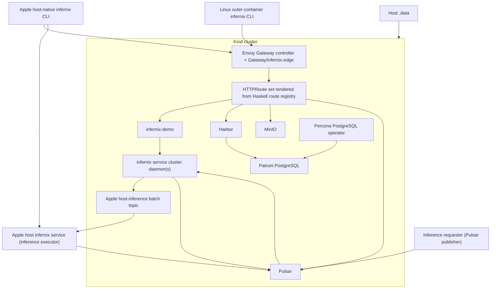

# Infernix Development Plan - Overview

**Status**: Authoritative source
**Referenced by**: [README.md](README.md), [system-components.md](system-components.md)

> **Purpose**: Capture the architecture baseline, hard constraints, control-plane topology,
> substrate contract, and canonical repository shape that every `infernix` phase depends on.

## Architecture Baseline

The repository target closes around the staged-substrate architecture: the two-binary topology,
mandatory local HA platform services, Harbor-first image flow, manual storage doctrine, Pulsar-only
production surface, Gateway-owned routing, Haskell-owned frontend contracts, substrate-specific
validation, and a daemon-role model where cluster `infernix service` daemons always exist while
Apple-native inference execution can be delegated to same-binary host daemons.

## Current Repo Assessment

The repository implements the substrate-file architecture described in this overview. The
governed validation surface now splits cleanly between focused substrate-file-independent lint or
docs checks and test commands that validate the active staged substrate before running:
`infernix lint docs` and `infernix docs check` validate documentation without reading the staged
substrate file, `infernix test unit` validates module behavior after command-level substrate
context is present, and `infernix test integration`, `infernix test e2e`, and `infernix test all`
run the complete relevant suites for the currently staged substrate instead of implying a default
cross-substrate rerun.
The worktree omits the direct tool-route compatibility payloads, persists Linux cluster state
before later rollout phases, and restages the active Linux substrate before each supported
bootstrap command.
The final Apple product shape described by this plan is implemented:
`apple-silicon` keeps Apple-native inference execution host-side for performance while Kind
continues to host Harbor, MinIO, Pulsar, PostgreSQL, Envoy Gateway, the optional routed demo
surface, and one or more cluster `infernix service` daemons. On Linux substrates, cluster daemons
read from Pulsar, run inference directly, and publish results; on Apple, cluster daemons read from
Pulsar and publish requests to a dedicated host batch topic consumed by same-binary host daemons,
which execute Apple-native inference and publish the completed result. The staged `.dhall` tells
each daemon the substrate, whether it is running in the cluster or on the host, and, for host
daemons, the Pulsar connection mode plus the batch and result topics it uses. Publication now
reports the cluster daemon location separately from the Apple host inference executor location and
batch topic. The runtime worker uses explicit Python or native adapter
harnesses selected from the staged substrate file. Those adapters currently produce deterministic
engine-family output from durable metadata rather than claiming universal production model-binary
execution. The Apple clean-host bootstrap
hardening is present in code: the stage-0 entrypoint verifies same-process ghcup-managed `ghc`
and `cabal` resolution before direct `cabal install`, reconciles Homebrew `protoc`, reconciles
Colima to the supported `8 CPU / 16 GiB` profile before Docker-backed work, and lets Apple
adapter setup or validation paths reconcile Homebrew `python@3.12` at
`/opt/homebrew/opt/python@3.12/bin/python3.12` plus a user-local Poetry bootstrap on demand.
Routed Apple
Playwright readiness probes `127.0.0.1` from the host while
the browser container joins the private Docker `kind` network and targets the Kind control-plane
DNS. The shared cluster lifecycle persists explicit phase, child-operation detail, and heartbeat
data in `cluster status` during monitored Docker build, Harbor publication, Kind-worker preload,
and Apple retained-state replay steps; explicit substrate-file materialization is atomic so
concurrent readers do not observe truncated payloads; and retained-state Apple reruns
automatically reinitialize stopped Harbor PostgreSQL replicas from the current Patroni leader when
timeline drift leaves replicas unready after promotion. Bootstrap support image preload now uses
the shared path on every supported lane, first trying `kind load docker-image` and then falling
back to direct worker containerd import when Kind's loader fails. Phase 6 records clean governed
bootstrap reruns for the supported Linux and Apple lifecycle surfaces, including the Apple rerun
on May 15, 2026 through `doctor`, `build`, `up`, `status`, `test`, `down`, and final
`status`; that rerun validated the split daemon topology, host-batch Pulsar handoff, routed
Playwright E2E, repeated retained-state cluster bring-up or teardown cycles inside the governed
`test` lane, and final post-teardown status returning `clusterPresent: False`,
`lifecycleStatus: idle`, and
`lifecyclePhase: cluster-absent`. That May 15 rerun also validates the Harbor publication closure
for repo-owned local images: publication pushes the `infernix-linux-cpu:local` payload before
third-party chart dependencies and re-tags the source image before each bounded push retry, so
retry recovery does not depend on a previously retained target tag. The earlier May 13 lifecycle
investigation remains the proof point that Apple `build-cluster-images` can stay healthy well past
thirty minutes before Harbor publication begins and that Harbor image pushes are readiness-gated
with bounded retries across transient registry resets.

| Area | Supported contract | Current repo state |
|------|--------------------|--------------------|
| Root-document governance | the governed docs, root docs, and plan describe the same staged-substrate doctrine and Apple daemon-role topology | implemented and validated |
| CLI ownership | one structured Haskell command registry owns the supported command surface without any `--runtime-mode` override | implemented |
| Substrate selection | one staged substrate file beside the active build root is the primary source of truth for substrate identity and generated catalog selection | implemented |
| Staged substrate-file format | the substrate file and its mirrors use one explicit and consistent file format and filename contract | implemented; the current contract is a shared `infernix-substrate.dhall` filename carrying banner-prefixed JSON on local and cluster-mounted paths |
| Apple split-executor lane | the host-built binary manages Kind, the cluster always runs `infernix service` daemons, and Apple-native inference batches are delegated to same-binary host daemons through Pulsar | implemented |
| Apple stage-0 bootstrap determinism | a first-run Apple bootstrap verifies newly installed same-process tool resolution before handing off to direct `cabal` work | implemented and validated through the governed Apple `doctor`, `build`, `up`, `status`, `test`, and `down` lifecycle |
| Lifecycle false-negative protection | supported lifecycle surfaces report long-running build, publication, preload, and teardown phases clearly enough that operators do not mistake progress for failure | implemented and validated; `cluster status` now reports in-progress lifecycle phase, detail, and heartbeat fields during the monitored long-running phases, and the governed docs use the same inactivity-aware interpretation contract |
| Linux control plane | all supported Linux CLI commands run through `docker compose run --rm infernix infernix ...` | implemented and validated through the supported `linux-cpu` and `linux-gpu` bootstrap lifecycles |
| Linux GPU naming | the NVIDIA-backed Linux substrate is standardized as `linux-gpu` | implemented |
| Serialized substrate naming | the generated substrate file, publication JSON, `cluster status`, and browser contracts still carry the active substrate under `runtimeMode` field names | implemented |
| Demo UI gating | the staged substrate file can disable the clustered demo surface | implemented; the supported materialization path accepts `--demo-ui false` |
| Simulation stance | no simulated cluster, route, transport, or generic inference-success fallback remains in the supported runtime or validation contract | implemented and validated; inference execution goes through typed adapter harnesses and unsupported adapters fail fast |
| Validation scope | integration uses one `.dhall`-driven suite over the README matrix, E2E stays substrate-agnostic at the browser layer, and `test all` runs every supported validation layer for one built substrate at a time | implemented and validated across the governed Linux and Apple lifecycle reruns |

Monitoring is not a supported first-class surface.

## Supported Outcome

`infernix` targets these rules:

- two repo-owned Haskell executables share the default Cabal library exposed by the `infernix`
  package (declared in `infernix.cabal` without an explicit library name and depended on as
  `infernix`): `infernix` for the production daemon, cluster lifecycle, validation, and internal
  helpers; `infernix-demo` for the routed demo HTTP host
- one structured Haskell command registry owns parsing, help text, and the canonical CLI
  reference, and the final command surface carries no `--runtime-mode` override
- the product standardizes three substrates:
  `apple-silicon`, `linux-cpu`, and `linux-gpu`
- the staged `infernix-substrate.dhall` file beside the active build root is the primary source of
  truth for substrate identity, generated catalog content, daemon role, inference placement,
  Pulsar topics, and validation scope
- the generated substrate file, routed publication surface, `cluster status` output, and generated
  browser contracts currently serialize that active substrate under `runtimeMode` field names even
  though the supported selection contract is substrate-based
- the current supported operator staging flow is explicit rather than Cabal-compile-time closure:
  Apple host-native workflows stage `./.build/infernix-substrate.dhall` with
  `./.build/infernix internal materialize-substrate apple-silicon [--demo-ui true|false]`, and
  Linux outer-container workflows stage `./.build/outer-container/build/infernix-substrate.dhall`
  on the host through the bind-mounted build tree with
  `docker compose run --rm infernix infernix internal materialize-substrate <runtime-mode> --demo-ui <true|false>`
- the Linux substrate Dockerfile also materializes a build-arg-selected substrate file inside the
  image overlay during image build; supported Compose runs bind-mount the host `./.build/` tree
  over that location, so lifecycle and aggregate test commands rely on the explicit host-visible
  restaging step
- repo-owned shell is limited to the `bootstrap/*.sh` stage-0 host bootstrap surface, which may
  reconcile supported host prerequisites, build the active substrate launcher and dedicated
  `infernix-playwright:local` images, and stage the substrate file under the active build root
  through `infernix internal materialize-substrate ...` idempotently before handing off to the
  direct `cabal`, `docker compose`, or `infernix` command surface
- supported stage-0 bootstrap entrypoints are restartable prerequisite reconcilers: they continue
  in the current process only after verifying the required executable they just installed or
  selected, and they stop at explicit new-shell or reboot boundaries so the operator reruns the
  same bootstrap command instead of jumping ahead to a later direct command
- supported runtime, cluster, cache, Kubernetes-wrapper, frontend-contract generation, and
  aggregate `infernix test ...` entrypoints fail fast if the staged substrate file is absent
  instead of regenerating it on first command execution or falling back to env or host detection;
  focused `infernix lint ...` and `infernix docs check` remain substrate-file independent
- the staged file retains the legacy `.dhall` filename even though the current payload is
  banner-prefixed JSON produced by Haskell helpers
- Apple Silicon is the only supported host-native build path outside a container
- on Apple Silicon, the host-built binary manages Kind, deploys the mandatory cluster support
  services, cluster `infernix service` daemons, and optional routed demo workload, and still owns
  the host-side same-binary inference daemon lane
- on Apple Silicon, cluster daemons are canonical for Pulsar ingress and host-batch handoff; host
  daemons are canonical for Apple-native inference execution and result publication and consume a
  dedicated Pulsar batch topic using their `.dhall` role metadata plus published edge state
- on Linux substrates, cluster daemons read from Pulsar, run inference directly, and publish
  results
- on Linux substrates, all supported CLI commands run through
  `docker compose run --rm infernix infernix ...`; there is no supported Linux host-native CLI
  story outside the outer container
- `linux-cpu` remains the only substrate meaningfully portable across unrelated host hardware; Apple
  operators may exercise it through Colima's amd64 VM, and arm64 Linux is a first-class CPU-only
  host shape
- `linux-gpu` assumes an amd64 Linux environment paired with a CUDA-capable device, but the outer
  control-plane container itself never requires the NVIDIA runtime
- supported entrypoints no longer use simulated cluster bring-up, direct tool-route compatibility
  handlers, generic inference-success fallback, or cross-substrate default validation reruns
- one substrate-aware integration suite traverses the comprehensive model, format, and engine
  matrix in `README.md`, reads the active substrate from `.dhall`, and chooses the corresponding
  engine binding for every supported row or reference
- Playwright E2E is substrate-agnostic at the browser layer and relies on `infernix-demo` reading
  the active `.dhall` to dispatch the correct engine behind the routed demo API
- the routed demo app remains cluster-resident when enabled, and the Apple routed path closes
  around an explicit cluster-daemon-to-host-daemon inference batch bridge rather than
  cluster-resident Apple inference execution
- the supported materialization path can emit `demo_ui = false` with `--demo-ui false`; omitting
  that flag keeps the default demo-enabled output
- Harbor-first bootstrap, Gateway-owned routing, mandatory local HA platform services,
  operator-managed Patroni PostgreSQL, manual `infernix-manual` storage, Haskell-owned frontend
  contracts, the shared Python adapter project, and untracked generated outputs all remain
  mandatory doctrine
- supported validation is substrate-specific: integration, E2E, and `test all` run the complete
  supported suites against the built and deployed substrate and report that substrate explicitly
- the supported control plane keeps one Haskell-owned command registry, imperative cluster or host
  prerequisite orchestration, the current `ormolu` plus `hlint` plus `cabal format` style stack,
  and the existing files or docs or chart or proto validation entrypoints rather than layering on
  an additional architecture-doctrine backlog
- every `infernix service` daemon remains startup-configured and Pulsar-driven without a separate
  admin-HTTP, hot-reload, or typed-event-ledger subsystem in the supported contract
- the test surface remains the current three Cabal stanzas plus the frontend unit suite:
  `infernix-unit`, `infernix-integration`, and `infernix-haskell-style`, exercised through the
  supported `infernix test lint|unit|integration|e2e|all` command surface

## Topology Baseline



Current code nuance: the topology above is the implemented supported path. Cluster daemons always
run, Linux cluster daemons perform inference locally, and Apple cluster daemons hand batches to
same-binary host inference daemons through Pulsar.

## Canonical Repository Shape

The authoritative repository shape closes toward the layout below. Generated-only paths such as
`web/src/Generated/` and `tools/generated_proto/` materialize on demand and stay untracked even
though they are part of the supported shape; a clean checkout may omit `tools/` until Python
protobuf generation runs.

```text
infernix/
├── DEVELOPMENT_PLAN/
├── documents/
│   ├── README.md
│   ├── documentation_standards.md
│   ├── architecture/
│   ├── development/
│   ├── engineering/
│   ├── operations/
│   ├── reference/
│   ├── tools/
│   └── research/
├── AGENTS.md
├── CLAUDE.md
├── README.md
├── Setup.hs
├── compose.yaml
├── infernix.cabal
├── cabal.project
├── app/
│   ├── Main.hs
│   └── Demo.hs
├── src/
│   └── Infernix/
│       ├── CLI.hs
│       ├── CommandRegistry.hs
│       ├── Routes.hs
│       ├── Web/
│       │   └── Contracts.hs
│       ├── Cluster/
│       ├── Demo/
│       ├── Lint/
│       ├── Runtime/
│       ├── Service.hs
│       ├── Storage.hs
│       └── Types.hs
├── proto/
│   └── infernix/
├── python/
│   ├── pyproject.toml
│   └── adapters/
├── web/
│   ├── spago.yaml
│   ├── src/
│   │   ├── *.purs
│   │   └── Generated/
│   ├── test/
│   └── playwright/
├── chart/
│   ├── Chart.yaml
│   ├── README.md
│   ├── values.yaml
│   └── templates/
│       ├── configmap-demo-catalog.yaml
│       ├── configmap-publication-state.yaml
│       ├── deployment-demo.yaml
│       ├── deployment-service.yaml
│       ├── envoyproxy.yaml
│       ├── gatewayclass.yaml
│       ├── gateway.yaml
│       ├── httproutes.yaml
│       ├── persistentvolumeclaim-service-data.yaml
│       ├── runtimeclass-nvidia.yaml
│       └── service-demo.yaml
├── kind/
│   ├── README.md
│   ├── cluster-apple-silicon.yaml
│   ├── cluster-linux-cpu.yaml
│   └── cluster-linux-gpu.yaml
├── docker/
│   ├── linux-substrate.Dockerfile
│   └── playwright.Dockerfile
├── tools/
│   └── generated_proto/
├── test/
├── .build/
│   ├── infernix
│   ├── infernix-demo
│   ├── infernix-substrate.dhall
│   └── outer-container/
│       └── build/
│           └── infernix-substrate.dhall
└── .data/
```

## Execution Contexts and Substrates

The plan keeps control-plane execution context separate from substrate.

### Control-Plane Execution Contexts

| Context | Canonical launcher | Purpose |
|---------|--------------------|---------|
| Apple host-native control plane | `./.build/infernix ...` | canonical operator surface on Apple Silicon |
| Linux outer-container control plane | `docker compose run --rm infernix infernix ...` | image-snapshot launcher for Linux CPU and Linux GPU workflows |

### Supported Substrates

| Substrate | Canonical substrate id | Typical role |
|-----------|------------------------|--------------|
| Apple Silicon / Metal | `apple-silicon` | cluster daemon plus host inference executor lane |
| Linux / CPU | `linux-cpu` | containerized CPU lane |
| Linux / NVIDIA GPU | `linux-gpu` | containerized CUDA-backed lane |

## Hard Constraints

### 0. Documentation-First Construction Rule

- Phase 0 remains the closed documentation and governance baseline for later doctrine resets.
- New documentation gaps land as explicit follow-on work in later phases.
- `README.md` stays an orientation layer.
- governed root docs carry explicit status, supersession, and canonical-home markers when they
  distinguish canonical guidance from entry-document summaries
- the canonical topic ownership under `documents/` remains in place, and
  `documents/architecture/runtime_modes.md` remains the current runtime or substrate architecture
  home despite the legacy filename and `runtimeMode` field names

### 1. Two Haskell Executables Sharing One Library

- `infernix` and `infernix-demo` are the only supported repo-owned Haskell executables
- both link the default Cabal library exposed by the `infernix` package (declared in
  `infernix.cabal` without an explicit library name and depended on as `infernix`)
- tests and helpers do not become extra supported executables

### 2. Dual Control-Plane Execution Contexts

- Apple host-native control plane is the canonical operator surface on Apple Silicon
- Linux outer-container control plane is the only supported Linux CLI surface
- Apple operators do not use Compose as a user-facing launcher for ordinary CLI work, but the
  Apple host CLI invokes `docker compose run --rm playwright` for routed E2E
- Linux host-native `infernix` execution outside a container is not a supported operator workflow

### 3. Three Supported Substrates

- `apple-silicon`, `linux-cpu`, and `linux-gpu` are the canonical substrate ids
- the built substrate selects the README matrix column
- control-plane execution context and substrate remain separate concepts
- `linux-cpu` is the only substrate that remains meaningfully portable across unrelated host
  hardware

### 4. Staged Substrate File SSoT

- the repo stages one `infernix-substrate.dhall` file under the active build root
- the current supported operator implementation materializes that file through an explicit helper
  command rather than Cabal compile rules alone
- Apple host-native workflows stage or restage the file with
  `./.build/infernix internal materialize-substrate apple-silicon [--demo-ui true|false]`
- Linux outer-container workflows stage or restage the file under `./.build/outer-container/build/`
  on the host with
  `docker compose run --rm infernix infernix internal materialize-substrate <runtime-mode> --demo-ui <true|false>`
- the Linux substrate image also creates a build-arg-selected copy during image build, but the
  supported Compose bind mount hides that image-local copy from host-launched operator commands
- supported runtime, cluster, cache, Kubernetes-wrapper, frontend-contract generation, and
  aggregate `infernix test ...` entrypoints fail fast if the staged file is absent; focused
  `infernix lint ...` and `infernix docs check` do not require it
- the staged file records the active substrate explicitly
- the staged file also carries the generated demo catalog for that substrate
- the current payload is banner-prefixed JSON under a legacy `.dhall` filename
- the current daemon reads that file at startup; automatic file-watching or reload is not part of
  the supported contract

### 5. Manual Storage Doctrine

- all default StorageClasses are deleted during bootstrap
- `infernix-manual` is the only supported persistent StorageClass
- PVs are created only by `infernix` lifecycle code and map deterministically into `./.data/`
- hand-authored standalone durable PVC manifests outside Helm or operator ownership are forbidden

### 5a. Protobuf Manifest and Event Contract

- repo-owned `.proto` schemas define runtime manifests and Pulsar payloads
- Haskell uses generated `proto-lens` bindings
- Python adapters consume matching generated protobuf modules

### 5b. Operator-Managed PostgreSQL Doctrine

- every in-cluster PostgreSQL dependency uses Patroni under the Percona Kubernetes operator
- charts that can self-deploy PostgreSQL disable that path and point to operator-managed clusters

### 6. Cluster Daemon With Host-Owned Apple Inference

- the demo UI is served only by `infernix-demo`
- when `demo_ui` is false in the active staged file, no demo UI or demo API route is published;
  the supported materialization path can emit that production-off value with `--demo-ui false`
- when `demo_ui` is true, the demo app is cluster-resident across substrates
- every substrate deploys cluster `infernix service` daemons
- on `linux-cpu` and `linux-gpu`, cluster daemons read requests from Pulsar, execute inference,
  and publish results
- on `apple-silicon`, cluster daemons consume request topics and publish inference work to a
  dedicated host batch topic consumed by same-binary host daemons, which execute Apple-native
  inference and publish results
- the staged `.dhall` tells each daemon its substrate, whether it is a cluster or host daemon, and,
  for host daemons, the Pulsar connection mode plus the batch and result topics it uses
- in multi-node topologies, the contract allows multiple anti-affined cluster daemons and one Apple
  host inference engine per node; Pulsar-owned topics, exclusive subscriptions, and
  acknowledgement handling keep batch ownership clear

### 7. Local Harbor Is The Cluster Image Source

- Harbor and only Harbor-required bootstrap services may pull upstream before Harbor is ready
- every remaining non-Harbor workload pulls from Harbor afterward

### 7a. Mandatory Local HA Service Topology

- Harbor, MinIO, Pulsar, and PostgreSQL close only on the mandatory local HA topology
- no alternate single-replica supported profile is introduced

### 8. Stable Edge Port and Route Prefixes via Envoy Gateway API

- routing is owned by Envoy Gateway API resources and repo-owned HTTPRoute manifests
- the route inventory comes from one Haskell route registry
- `cluster up` tries port `9090` first and increments by 1 until it finds an open localhost port

### 8a. `cluster up` Is A Reconcile Flow

- `infernix cluster up` reconciles cluster, storage, image publication, generated config, and edge
  port selection
- `infernix cluster down` preserves durable state under `./.data/`

### 8b. Integration and E2E Cover The Built Substrate Only

- `infernix test integration` validates the built substrate's generated catalog contract, routed
  surfaces, and routed inference execution for every generated catalog entry on that substrate
- the comprehensive model, format, and engine matrix in `README.md` is the authoritative
  integration-test coverage ledger
- one substrate-aware integration suite reads the active substrate from `.dhall`, selects the
  corresponding engine binding for each supported README row or reference, and carries at least one
  integration assertion for every such row
- `infernix test e2e` exercises the routed browser surface for that same built substrate without
  branching on substrate or engine in browser code
- validation reports the substrate it exercised and does not imply cross-substrate coverage from a
  single run

### 9. Haskell Types Own Frontend Contracts

- handwritten browser-contract ADTs live in `src/Infernix/Web/Contracts.hs`
- generated PureScript contract output lives in `web/src/Generated/`
- no handwritten duplicate DTO layer exists on the frontend

### 10. Playwright Runs From The Dedicated Playwright Image

- routed Playwright execution runs from the dedicated `infernix-playwright:local` image built by
  `docker/playwright.Dockerfile` on every substrate
- on Apple Silicon, the host CLI invokes `docker compose run --rm playwright` directly against the
  host docker daemon
- on Linux substrates, the outer container invokes the same `docker compose run --rm playwright`
  through the mounted host docker socket
- browser and Playwright code do not branch on substrate id or engine family; `infernix-demo`
  reads the active `.dhall` and owns substrate-appropriate engine dispatch
- supported workflows use `npm --prefix web exec -- playwright ...`; `npx` is not part of the
  supported final workflow

### 11. Container Build Output Stays Under `./.build/outer-container/`

- Linux outer-container build output stays under `./.build/outer-container/` on the host through
  a host-anchored bind mount; the staged substrate file lives in that tree while cabal builddir,
  cabal package cache, and the source snapshot manifest stay in the image overlay
- the outer-container launcher does not rely on a live repo bind mount for source code; the only
  bind mounts are `./.data/`, `./.build/`, the host `compose.yaml`, and the Docker socket
- the staged outer-container substrate `.dhall` sits at
  `./.build/outer-container/build/infernix-substrate.dhall` on the host and is the source material
  for cluster ConfigMap publication, which mounts the file at `/opt/build/infernix-substrate.dhall`
  inside cluster-resident pods

### 12. Apple Host Build Output Stays Under `./.build`

- host-native compiled artifacts stay under `./.build/`
- the Apple substrate `.dhall` sits beside `./.build/infernix`
- `cluster up` writes the repo-local kubeconfig to `./.build/infernix.kubeconfig`

### 13. Python Restriction

- custom platform logic is Haskell
- Python is allowed only under `python/adapters/`
- each adapter is invoked only through `poetry run`
- the canonical Python quality gate is `poetry run check-code`
- on Apple Silicon, Poetry may materialize `python/.venv/` on demand

### 14. Production Surface Is Pulsar-Only

- production inference requests arrive by Pulsar topics only
- cluster daemons own production request-topic consumption on every substrate
- Linux cluster daemons execute inference and publish results directly, while Apple cluster
  daemons publish work to a host-inference Pulsar topic consumed by same-binary host daemons that
  publish the completed results
- production `infernix service` binds no HTTP listener
- the demo HTTP API is a demo-only surface owned by `infernix-demo`
- simulated cluster, route, transport, and generic inference-success fallback behavior are not part
  of the supported final contract

### 15. Frontend Language Is PureScript

- the demo UI is implemented in PureScript
- the supported browser test framework is `purescript-spec`
- the supported browser bundle is built with spago

## Command Surface Baseline

The supported operator surface is:

- `infernix service`
- `infernix cluster up`
- `infernix cluster down`
- `infernix cluster status`
- `infernix cache status`
- `infernix cache evict`
- `infernix cache rebuild`
- `infernix kubectl ...`
- `infernix lint files`
- `infernix lint docs`
- `infernix lint proto`
- `infernix lint chart`
- `infernix test lint`
- `infernix test unit`
- `infernix test integration`
- `infernix test e2e`
- `infernix test all`
- `infernix docs check`

Internal helper commands may exist in the implementation, but the supported command contract closes
through the registry-backed surface above.

## Completion Rules

- later phases may refine earlier foundations, but they may not contradict them
- if a cleanup changes the supported end state, earlier phase text must be rewritten so later
  phases extend the narrative instead of undoing it
- `Done` claims require validation, aligned docs, and no hidden remaining work

## Cross-References

- [README.md](README.md)
- [system-components.md](system-components.md)
- [phase-0-documentation-and-governance.md](phase-0-documentation-and-governance.md)
- [phase-1-repository-and-control-plane-foundation.md](phase-1-repository-and-control-plane-foundation.md)
- [phase-2-kind-cluster-storage-and-lifecycle.md](phase-2-kind-cluster-storage-and-lifecycle.md)
- [phase-3-ha-platform-services-and-edge-routing.md](phase-3-ha-platform-services-and-edge-routing.md)
- [phase-4-inference-service-and-durable-runtime.md](phase-4-inference-service-and-durable-runtime.md)
- [phase-5-web-ui-and-shared-types.md](phase-5-web-ui-and-shared-types.md)
- [phase-6-validation-e2e-and-ha-hardening.md](phase-6-validation-e2e-and-ha-hardening.md)
- [legacy-tracking-for-deletion.md](legacy-tracking-for-deletion.md)
