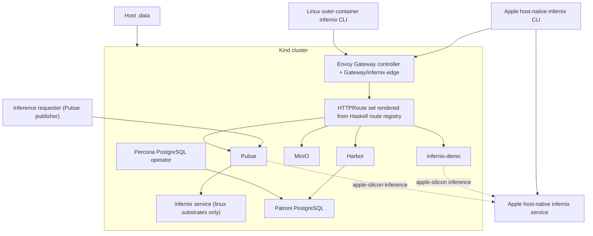

# Infernix Development Plan - Overview

**Status**: Authoritative source
**Referenced by**: [README.md](README.md), [system-components.md](system-components.md)

> **Purpose**: Capture the architecture baseline, hard constraints, control-plane topology,
> substrate contract, and canonical repository shape that every `infernix` phase depends on.

## Current Repo Assessment

The repository now implements the substrate-file architecture described in this overview. The
supported validation contract is active-substrate specific: `infernix lint docs`, the Haskell and
PureScript unit suites, `infernix test integration`, and `infernix test e2e` all target the
currently staged substrate instead of implying a default cross-substrate rerun. The current Linux
outer-container reruns are not fully closed: `linux-cpu` can leave `cluster up` stuck at
`cluster not yet reconciled`, and `linux-gpu` can reuse a stale staged `linux-cpu` substrate file
instead of restaging `linux-gpu`.

| Area | Supported contract | Current repo state |
|------|--------------------|--------------------|
| Root-document governance | the governed docs, root docs, and plan all describe the same staged-substrate doctrine | implemented |
| CLI ownership | one structured Haskell command registry owns the supported command surface without any `--runtime-mode` override | implemented |
| Substrate selection | one staged substrate file beside the active build root is the primary source of truth for substrate identity and generated catalog selection | implemented |
| Staged substrate-file format | the substrate file and its mirrors use one explicit and consistent file format and filename contract | implemented; the current contract is a shared `infernix-substrate.dhall` filename carrying banner-prefixed JSON on local and cluster-mounted paths |
| Apple host-native lane | the host-built binary manages Kind, deploys the clustered demo workloads, and still owns the direct host-side `infernix service` lane | implemented |
| Linux control plane | all supported Linux CLI commands run through `docker compose run --rm infernix infernix ...` | partially implemented; the supported launcher surface exists, but the current `linux-cpu` rerun can stall in unreconciled `cluster up`, and the `linux-gpu` bootstrap can reuse a stale staged CPU substrate |
| Linux GPU naming | the NVIDIA-backed Linux substrate is standardized as `linux-gpu` | implemented |
| Serialized substrate naming | the generated substrate file, publication JSON, `cluster status`, and browser contracts still carry the active substrate under `runtimeMode` field names | implemented |
| Demo UI gating | the staged substrate file can disable the clustered demo surface | implemented; the supported materialization path accepts `--demo-ui false` |
| Simulation stance | no simulated cluster, route, transport, or inference fallback remains in the supported runtime or validation contract | partially implemented; supported entrypoints no longer use simulated cluster bring-up, but `src/Infernix/Demo/Api.hs` still carries tool-route placeholder handlers and integration still accepts their `rewrittenPath` responses |
| Validation scope | integration uses one `.dhall`-driven suite over the README matrix, E2E stays substrate-agnostic at the browser layer, and `test all` validates one built substrate at a time | partially implemented; the active-substrate contract is in place, but the supported Linux CPU and GPU lifecycle reruns still fail before full `test all` closure |

Monitoring is not a supported first-class surface.

## Supported Outcome

`infernix` closes around these rules:

- two repo-owned Haskell executables share the default Cabal library exposed by the `infernix`
  package (declared in `infernix.cabal` without an explicit library name and depended on as
  `infernix`): `infernix` for the production daemon, cluster lifecycle, validation, and internal
  helpers; `infernix-demo` for the routed demo HTTP host
- one structured Haskell command registry owns parsing, help text, and the canonical CLI
  reference, and the final command surface carries no `--runtime-mode` override
- the product standardizes three substrates:
  `apple-silicon`, `linux-cpu`, and `linux-gpu`
- the staged `infernix-substrate.dhall` file beside the active build root is the primary source of
  truth for substrate identity, generated catalog content, daemon placement, and validation scope
- the generated substrate file, routed publication surface, `cluster status` output, and generated
  browser contracts currently serialize that active substrate under `runtimeMode` field names even
  though the supported selection contract is substrate-based
- the current staging flow is explicit rather than Cabal-compile-time closure:
  Apple host-native workflows stage `./.build/infernix-substrate.dhall` with
  `./.build/infernix internal materialize-substrate apple-silicon [--demo-ui true|false]`, and
  Linux outer-container workflows stage `./.build/outer-container/build/infernix-substrate.dhall`
  on the host through the bind-mounted build tree with
  `docker compose run --rm infernix infernix internal materialize-substrate <runtime-mode> --demo-ui <true|false>`
- repo-owned shell is limited to the `bootstrap/*.sh` stage-0 host bootstrap surface, which may
  reconcile supported host prerequisites, build the active substrate launcher and dedicated
  `infernix-playwright:local` images, and stage the substrate file under the active build root
  through `infernix internal materialize-substrate ...` idempotently before handing off to the
  direct `cabal`, `docker compose`, or `infernix` command surface
- supported runtime, cluster, and validation entrypoints fail fast if the staged substrate file is
  absent instead of regenerating it on first command execution or falling back to env or host
  detection
- the staged file retains the legacy `.dhall` filename even though the current payload is
  banner-prefixed JSON produced by Haskell helpers
- Apple Silicon is the only supported host-native build path outside a container
- on Apple Silicon, the host-built binary manages Kind, deploys the clustered demo workloads, and
  still owns the direct host-side `infernix service` lane; the routed demo and Playwright paths do
  not manage a separate host daemon in the current code path
- on Linux substrates, all supported CLI commands run through
  `docker compose run --rm infernix infernix ...`; there is no supported Linux host-native CLI
  story outside the outer container
- `linux-cpu` remains the only substrate meaningfully portable across unrelated host hardware; Apple
  operators may exercise it through Colima's amd64 VM, and arm64 Linux is a first-class CPU-only
  host shape
- `linux-gpu` assumes an amd64 Linux environment paired with a CUDA-capable device, but the outer
  control-plane container itself never requires the NVIDIA runtime
- supported entrypoints no longer use simulated cluster bring-up or cross-substrate default
  validation reruns, but the repo still carries direct tool-route placeholder handlers in
  `src/Infernix/Demo/Api.hs`, and `test/integration/Spec.hs` still accepts their `rewrittenPath`
  responses instead of requiring only the real routed upstream behavior
- one substrate-aware integration suite traverses the comprehensive model, format, and engine
  matrix in `README.md`, reads the active substrate from `.dhall`, and chooses the corresponding
  engine binding for every supported row or reference
- Playwright E2E is substrate-agnostic at the browser layer and relies on `infernix-demo` reading
  the active `.dhall` to dispatch the correct engine behind the routed demo API
- the routed demo app is cluster-resident across substrates; the Apple host bridge is not part of
  the final steady-state contract
- the supported materialization path can emit `demo_ui = false` with `--demo-ui false`; omitting
  that flag keeps the default demo-enabled output
- Harbor-first bootstrap, Gateway-owned routing, mandatory local HA platform services,
  operator-managed Patroni PostgreSQL, manual `infernix-manual` storage, Haskell-owned frontend
  contracts, the shared Python adapter project, and untracked generated outputs all remain
  mandatory doctrine
- supported validation is substrate-specific: integration, E2E, and `test all` exercise only the
  built and deployed substrate and report that substrate explicitly

## Topology Baseline



## Canonical Repository Shape

The authoritative repository shape closes toward the layout below. Generated-only paths such as
`web/src/Generated/` and `tools/generated_proto/` materialize on demand and stay untracked even
though they are part of the supported shape.

```text
infernix/
├── DEVELOPMENT_PLAN/
├── documents/
│   ├── README.md
│   ├── documentation_standards.md
│   ├── architecture/
│   ├── development/
│   ├── engineering/
│   ├── operations/
│   ├── reference/
│   ├── tools/
│   └── research/
├── AGENTS.md
├── CLAUDE.md
├── README.md
├── Setup.hs
├── compose.yaml
├── infernix.cabal
├── cabal.project
├── app/
│   ├── Main.hs
│   └── Demo.hs
├── src/
│   └── Infernix/
│       ├── CLI.hs
│       ├── CommandRegistry.hs
│       ├── Routes.hs
│       ├── Web/
│       │   └── Contracts.hs
│       ├── Cluster/
│       ├── Demo/
│       ├── Lint/
│       ├── Runtime/
│       ├── Service.hs
│       ├── Storage.hs
│       └── Types.hs
├── proto/
│   └── infernix/
├── python/
│   ├── pyproject.toml
│   └── adapters/
├── web/
│   ├── spago.yaml
│   ├── src/
│   │   ├── *.purs
│   │   └── Generated/
│   ├── test/
│   └── playwright/
├── chart/
│   └── templates/
│       ├── gatewayclass.yaml
│       ├── gateway.yaml
│       ├── httproutes.yaml
│       ├── configmap-demo-catalog.yaml
│       └── configmap-publication-state.yaml
├── kind/
├── docker/
│   └── linux-substrate.Dockerfile
├── tools/
│   └── generated_proto/
├── test/
├── .build/
│   ├── infernix
│   ├── infernix-demo
│   └── infernix-substrate.dhall
└── .data/
```

## Execution Contexts and Substrates

The plan keeps control-plane execution context separate from substrate.

### Control-Plane Execution Contexts

| Context | Canonical launcher | Purpose |
|---------|--------------------|---------|
| Apple host-native control plane | `./.build/infernix ...` | canonical operator surface on Apple Silicon |
| Linux outer-container control plane | `docker compose run --rm infernix infernix ...` | image-snapshot launcher for Linux CPU and Linux GPU workflows |

### Supported Substrates

| Substrate | Canonical substrate id | Typical role |
|-----------|------------------------|--------------|
| Apple Silicon / Metal | `apple-silicon` | host-native inference lane |
| Linux / CPU | `linux-cpu` | containerized CPU lane |
| Linux / NVIDIA GPU | `linux-gpu` | containerized CUDA-backed lane |

## Hard Constraints

### 0. Documentation-First Construction Rule

- Phase 0 remains the reopened documentation and governance gate for this doctrine reset.
- New documentation gaps land as explicit follow-on work in later phases.
- `README.md` stays an orientation layer.
- governed root docs carry explicit status, supersession, and canonical-home markers when they
  distinguish canonical guidance from entry-document summaries
- the current canonical topic ownership under `documents/` remains in place until the later
  substrate-language updates land, even where a path such as
  `documents/architecture/runtime_modes.md` still carries legacy naming

### 1. Two Haskell Executables Sharing One Library

- `infernix` and `infernix-demo` are the only supported repo-owned Haskell executables
- both link the default Cabal library exposed by the `infernix` package (declared in
  `infernix.cabal` without an explicit library name and depended on as `infernix`)
- tests and helpers do not become extra supported executables

### 2. Dual Control-Plane Execution Contexts

- Apple host-native control plane is the canonical operator surface on Apple Silicon
- Linux outer-container control plane is the only supported Linux CLI surface
- Apple operators do not use Compose as a user-facing launcher for ordinary CLI work, but the
  Apple host CLI invokes `docker compose run --rm playwright` for routed E2E
- Linux host-native `infernix` execution outside a container is not a supported operator workflow

### 3. Three Supported Substrates

- `apple-silicon`, `linux-cpu`, and `linux-gpu` are the canonical substrate ids
- the built substrate selects the README matrix column
- control-plane execution context and substrate remain separate concepts
- `linux-cpu` is the only substrate that remains meaningfully portable across unrelated host
  hardware

### 4. Staged Substrate File SSoT

- the repo stages one `infernix-substrate.dhall` file under the active build root
- the current implementation materializes that file through an explicit helper command rather than
  Cabal compile rules alone
- Apple host-native workflows stage or restage the file with
  `./.build/infernix internal materialize-substrate apple-silicon [--demo-ui true|false]`
- Linux outer-container workflows stage or restage the file under `./.build/outer-container/build/`
  on the host with
  `docker compose run --rm infernix infernix internal materialize-substrate <runtime-mode> --demo-ui <true|false>`
- supported runtime, cluster, and validation entrypoints fail fast if the staged file is absent
- the staged file records the active substrate explicitly
- the staged file also carries the generated demo catalog for that substrate
- the current payload is banner-prefixed JSON under a legacy `.dhall` filename
- the binary watches that file and reloads or restarts on changes, purging running inference
  engines

### 5. Manual Storage Doctrine

- all default StorageClasses are deleted during bootstrap
- `infernix-manual` is the only supported persistent StorageClass
- PVs are created only by `infernix` lifecycle code and map deterministically into `./.data/`
- hand-authored standalone durable PVC manifests are forbidden

### 5a. Protobuf Manifest and Event Contract

- repo-owned `.proto` schemas define runtime manifests and Pulsar payloads
- Haskell uses generated `proto-lens` bindings
- Python adapters consume matching generated protobuf modules

### 5b. Operator-Managed PostgreSQL Doctrine

- every in-cluster PostgreSQL dependency uses Patroni under the Percona Kubernetes operator
- charts that can self-deploy PostgreSQL disable that path and point to operator-managed clusters

### 6. Cluster-Resident Demo UI With Host-Owned Apple Inference

- the demo UI is served only by `infernix-demo`
- when `demo_ui` is false in the active staged file, no demo UI or demo API route is published;
  the supported materialization path can emit that production-off value with `--demo-ui false`
- when `demo_ui` is true, the demo app is cluster-resident across substrates
- on `apple-silicon`, the routed demo surface remains cluster-resident while the direct host-side
  `infernix service` lane stays distinct from that browser-facing path

### 7. Local Harbor Is The Cluster Image Source

- Harbor and only Harbor-required bootstrap services may pull upstream before Harbor is ready
- every remaining non-Harbor workload pulls from Harbor afterward

### 7a. Mandatory Local HA Service Topology

- Harbor, MinIO, Pulsar, and PostgreSQL close only on the mandatory local HA topology
- no alternate single-replica supported profile is introduced

### 8. Stable Edge Port and Route Prefixes via Envoy Gateway API

- routing is owned by Envoy Gateway API resources and repo-owned HTTPRoute manifests
- the route inventory comes from one Haskell route registry
- `cluster up` tries port `9090` first and increments by 1 until it finds an open localhost port

### 8a. `cluster up` Is A Reconcile Flow

- `infernix cluster up` reconciles cluster, storage, image publication, generated config, and edge
  port selection
- `infernix cluster down` preserves durable state under `./.data/`

### 8b. Integration and E2E Cover The Built Substrate Only

- `infernix test integration` validates the built substrate's generated catalog contract, routed
  surfaces, and routed inference execution for every generated catalog entry on that substrate
- the comprehensive model, format, and engine matrix in `README.md` is the authoritative
  integration-test coverage ledger
- one substrate-aware integration suite reads the active substrate from `.dhall`, selects the
  corresponding engine binding for each supported README row or reference, and carries at least one
  integration assertion for every such row
- `infernix test e2e` exercises the routed browser surface for that same built substrate without
  branching on substrate or engine in browser code
- validation reports the single substrate it exercised and does not imply matrix-wide coverage it
  did not run

### 9. Haskell Types Own Frontend Contracts

- handwritten browser-contract ADTs live in `src/Infernix/Web/Contracts.hs`
- generated PureScript contract output lives in `web/src/Generated/`
- no handwritten duplicate DTO layer exists on the frontend

### 10. Playwright Runs From The Dedicated Playwright Image

- routed Playwright execution runs from the dedicated `infernix-playwright:local` image built by
  `docker/playwright.Dockerfile` on every substrate
- on Apple Silicon, the host CLI invokes `docker compose run --rm playwright` directly against the
  host docker daemon
- on Linux substrates, the outer container invokes the same `docker compose run --rm playwright`
  through the mounted host docker socket
- browser and Playwright code do not branch on substrate id or engine family; `infernix-demo`
  reads the active `.dhall` and owns substrate-appropriate engine dispatch
- supported workflows use `npm --prefix web exec -- playwright ...`; `npx` is not part of the
  supported final workflow

### 11. Container Build Output Stays Under `./.build/outer-container/`

- Linux outer-container build output stays under `./.build/outer-container/` on the host through
  a host-anchored bind mount; the staged substrate file lives in that tree while cabal builddir,
  cabal package cache, and the source snapshot manifest stay in the image overlay
- the outer-container launcher does not rely on a live repo bind mount for source code; the only
  bind mounts are `./.data/`, `./.build/`, the host `compose.yaml`, and the Docker socket
- the staged outer-container substrate `.dhall` sits at
  `./.build/outer-container/build/infernix-substrate.dhall` on the host and is the source material
  for cluster ConfigMap publication, which mounts the file at `/opt/build/infernix/infernix-substrate.dhall`
  inside cluster-resident pods

### 12. Apple Host Build Output Stays Under `./.build`

- host-native compiled artifacts stay under `./.build/`
- the Apple substrate `.dhall` sits beside `./.build/infernix`
- `cluster up` writes the repo-local kubeconfig to `./.build/infernix.kubeconfig`

### 13. Python Restriction

- custom platform logic is Haskell
- Python is allowed only under `python/adapters/`
- each adapter is invoked only through `poetry run`
- the canonical Python quality gate is `poetry run check-code`
- on Apple Silicon, Poetry may materialize `python/.venv/` on demand

### 14. Production Surface Is Pulsar-Only

- production inference requests arrive by Pulsar topics only
- production `infernix service` binds no HTTP listener
- the demo HTTP API is a demo-only surface owned by `infernix-demo`
- simulated cluster, route, transport, and inference fallback behavior are not part of the
  supported final contract

### 15. Frontend Language Is PureScript

- the demo UI is implemented in PureScript
- the supported browser test framework is `purescript-spec`
- the supported browser bundle is built with spago

## Command Surface Baseline

The supported operator surface is:

- `infernix service`
- `infernix cluster up`
- `infernix cluster down`
- `infernix cluster status`
- `infernix cache status`
- `infernix cache evict`
- `infernix cache rebuild`
- `infernix kubectl ...`
- `infernix lint files`
- `infernix lint docs`
- `infernix lint proto`
- `infernix lint chart`
- `infernix test lint`
- `infernix test unit`
- `infernix test integration`
- `infernix test e2e`
- `infernix test all`
- `infernix docs check`

Internal helper commands may exist in the implementation, but the supported command contract closes
through the registry-backed surface above.

## Completion Rules

- later phases may refine earlier foundations, but they may not contradict them
- if a cleanup changes the supported end state, earlier phase text must be rewritten so later
  phases extend the narrative instead of undoing it
- `Done` claims require validation, aligned docs, and no hidden remaining work

## Cross-References

- [README.md](README.md)
- [system-components.md](system-components.md)
- [phase-0-documentation-and-governance.md](phase-0-documentation-and-governance.md)
- [phase-1-repository-and-control-plane-foundation.md](phase-1-repository-and-control-plane-foundation.md)
- [phase-2-kind-cluster-storage-and-lifecycle.md](phase-2-kind-cluster-storage-and-lifecycle.md)
- [phase-3-ha-platform-services-and-edge-routing.md](phase-3-ha-platform-services-and-edge-routing.md)
- [phase-4-inference-service-and-durable-runtime.md](phase-4-inference-service-and-durable-runtime.md)
- [phase-5-web-ui-and-shared-types.md](phase-5-web-ui-and-shared-types.md)
- [phase-6-validation-e2e-and-ha-hardening.md](phase-6-validation-e2e-and-ha-hardening.md)
- [legacy-tracking-for-deletion.md](legacy-tracking-for-deletion.md)
