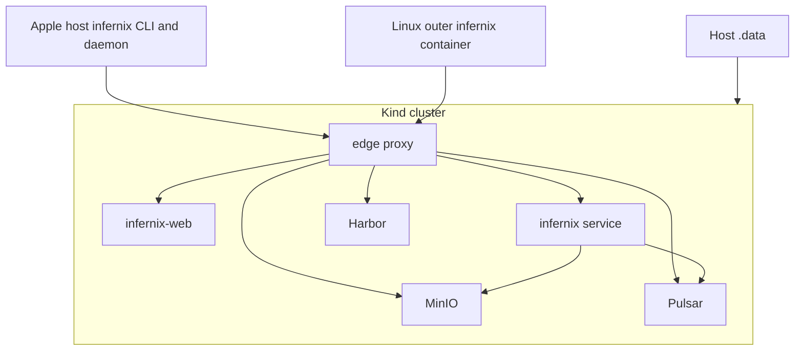

# Infernix Development Plan - Overview

**Status**: Authoritative source
**Referenced by**: [README.md](README.md), [system-components.md](system-components.md)

> **Purpose**: Capture the architecture baseline, hard constraints, control-plane topology,
> runtime-mode contract, and canonical repository shape that every `infernix` phase depends on.

## Current Repo Assessment

The repository already contains partial implementation work, but it has not yet closed the full
contract described by the updated root README.

| Area | Current state | Gap against target |
|------|---------------|--------------------|
| Development plan and docs suite | present | the plan now carries the updated runtime-mode contract, but Phase 0 still must realign the governed docs around the three runtime modes, generated demo `.dhall`, and per-mode exhaustive validation contract |
| Haskell service | present | host-native service entrypoint is working; matrix-aware runtime binding, ConfigMap-backed catalog consumption, `.proto`-based manifest and Pulsar payload closure, Linux CPU parity, and CUDA runtime closure remain open |
| Kind and Helm assets | partial | local cluster-state compatibility surfaces are implemented; real Kind and Helm rollout remains open |
| Runtime-mode matrix | partial | repo ships a seeded toy catalog; the README-scale model, format, and engine matrix is not yet encoded as the generated source of truth |
| Generated demo config | partial | repo emits a generic test config; mode-specific `infernix-demo-<mode>.dhall` staging, ConfigMap publication, and coverage guarantees remain open |
| Web app | present | manual inference workbench, generated contracts, and browser tests exist; mode-driven catalog parity and image-backed deployment rules remain open |
| Tests | present | lint, unit, integration, and E2E entrypoints run; active-mode exhaustive catalog coverage and full Apple or CPU or CUDA matrix execution remain open |

## Target Outcome

`infernix` is a Kind-forward local inference platform that:

- uses one Haskell executable named `infernix` for service runtime, cluster lifecycle, and test orchestration
- uses one Kind cluster as the supported local substrate
- deploys Harbor, MinIO, and Pulsar through Helm with one mandatory local HA topology: 3x Harbor,
  4x MinIO, and 3x Pulsar replicas where the chosen charts expose those replica surfaces
- uses local Harbor as the image source for every cluster pod except Harbor's own bootstrap pods
- deletes default storage classes and relies only on a manual `kubernetes.io/no-provisioner` storage class
- creates PVs manually under `./.data/` and permits PVC creation only through Helm-owned stateful workloads
- serves the PureScript web UI from a cluster-resident webapp service, built as a separate binary
  and container image from `infernix`, in every supported runtime mode
- exposes the UI, API, Harbor, MinIO, and Pulsar browser surfaces through one reverse-proxied localhost edge port
- keeps Haskell types authoritative for frontend contracts and verifies the PureScript side with `purescript-spec`
- supports `linux-cuda` only through a GPU-enabled Kind cluster path that exposes NVIDIA container
  runtime support and `nvidia.com/gpu` resources to cluster workloads
- stages the active runtime mode's demo catalog as `infernix-demo-<mode>.dhall` during `cluster up`
  and publishes it into `ConfigMap/infernix-demo-config`
- derives the demo UI catalog, service runtime bindings, and integration or E2E enumeration from
  that ConfigMap-backed mounted `.dhall` file for the active mode
- defines runtime manifests and Pulsar payloads in repo-owned `.proto` schemas, using
  `proto-lens` for Haskell bindings and Pulsar's built-in protobuf schema support for topic payloads
- enforces Haskell static quality with `fourmolu`, `cabal-fmt`, `hlint`, and strict compiler warnings through `infernix test lint`
- runs Playwright from the same container image that serves the web UI

## Topology Baseline



## Canonical Repository Shape

The repository layout authority moves here from `README.md`. The intended shape at full plan
closure is:

```text
infernix/
├── DEVELOPMENT_PLAN/
├── documents/
│   ├── README.md
│   ├── documentation_standards.md
│   ├── architecture/
│   ├── development/
│   ├── engineering/
│   ├── operations/
│   ├── reference/
│   ├── tools/
│   └── research/
├── infernix.cabal
├── cabal.project
├── app/
│   └── Main.hs
├── src/
│   └── Infernix/
│       ├── CLI/
│       ├── Cluster/
│       ├── Config/
│       ├── Manifest/
│       ├── MinIO/
│       ├── Models/
│       ├── Pulsar/
│       ├── Runtime/
│       ├── Service/
│       ├── Storage/
│       └── Types/
├── proto/
│   └── infernix/
│       ├── api/
│       ├── manifest/
│       └── runtime/
├── web/
│   ├── src/
│   ├── test/
│   ├── playwright/
│   └── Dockerfile
├── chart/
├── kind/
├── docker/
├── test/
│   ├── unit/
│   └── integration/
├── .build/
└── .data/
```

## Execution Contexts and Runtime Modes

The plan keeps control-plane execution context separate from runtime mode.

### Control-Plane Execution Contexts

| Context | Canonical launcher | Purpose |
|---------|--------------------|---------|
| Apple host-native control plane | `./.build/infernix ...` | direct host execution on Apple Silicon |
| Linux outer-container control plane | `docker compose run --rm infernix infernix ...` | containerized Linux launcher with Docker socket forwarding |

### Runtime Modes

| Runtime mode | Canonical mode id | Engine column from README matrix | Typical role |
|--------------|-------------------|----------------------------------|--------------|
| Apple Silicon / Metal | `apple-silicon` | `Best Apple Silicon engine` | Apple-native runtime parity and local development |
| Ubuntu 24.04 / CPU | `linux-cpu` | `Best Linux CPU engine` | CPU-only validation and fallback execution |
| Ubuntu 24.04 / NVIDIA CUDA Container | `linux-cuda` | `Best Linux CUDA engine` | CUDA-backed high-throughput execution |

The control-plane execution context decides where `infernix` runs. The runtime mode decides which
engine binding is selected for each matrix row, which generated demo `.dhall` content is staged and
published, and which catalog entries integration and E2E tests must cover.

## Hard Constraints

### 0. Documentation-First Construction Rule

Phase 0 creates and maintains the governed `documents/` suite before later phases can close.

- While Phase 0 is open, later phases remain blocked at the phase level.
- The repository README stays an orientation document and does not re-absorb the canonical rules
  that Phase 0 moves into `documents/`.

### 1. Single Haskell Binary

The repo ships one Haskell executable, `infernix`.

- `infernix service` runs the service runtime.
- `infernix cluster ...` owns Kind and Helm lifecycle.
- `infernix test ...` owns validation entrypoints.
- No second repo-owned Haskell executable exists for tests, bootstrap wrappers, or sidecar helpers.

### 2. Dual Control-Plane Execution Contexts

The supported local operator surface is platform-sensitive:

- Apple Silicon: `./.build/infernix` runs directly on the host and shells out to host-installed
  `kind`, `kubectl`, `helm`, and Docker.
- Apple Silicon host builds place the compiled binary and other generated build artifacts under
  `./.build/`.
- On Apple Silicon, `cluster up` writes the repo-local kubeconfig to `./.build/infernix.kubeconfig`
  and must not mutate `$HOME/.kube/config` or the user's global current context.
- `infernix kubectl ...` is the supported wrapper for Kubernetes access and automatically targets
  the repo-local kubeconfig under `./.build/`.
- On Apple Silicon, `infernix` may install missing host prerequisites needed by supported local
  runtime flows, including Homebrew-installed `poetry` when absent and other required Python
  dependencies.
- Containerized Linux: `docker compose run --rm infernix infernix ...` is the supported launcher,
  with the Docker socket forwarded and `./.data/` bind mounted.

The distinction is about where `infernix` runs, not whether Kind uses containers. Kind still
depends on Docker in both execution contexts.

### 3. Three Supported Runtime Modes

The supported product contract always names all three runtime modes:

- `apple-silicon`
- `linux-cpu`
- `linux-cuda`

No plan document treats Linux CPU and Linux CUDA as one undifferentiated "Linux mode". The engine
binding for a model or workload comes from the runtime mode's column in the README matrix.

### 3a. `linux-cuda` Requires GPU-Enabled Kind

`linux-cuda` is not just a model-selection flag. It changes the Kind substrate.

- `cluster up` in `linux-cuda` reconciles a GPU-capable Kind cluster path that exposes NVIDIA
  container runtime support inside the Kind node containers.
- The Kubernetes node inventory advertises `nvidia.com/gpu` resources through the NVIDIA device
  plugin or an equivalent supported mechanism.
- CUDA workloads request `nvidia.com/gpu` and use repo-owned runtime or scheduling configuration,
  such as `runtimeClassName: nvidia` when needed by the chosen implementation.

### 4. Generated Mode-Specific Demo `.dhall` and ConfigMap Publication

`cluster up` generates one demo catalog for the active runtime mode.

- The generated filename is `infernix-demo-<mode>.dhall`.
- Apple host mode may stage the file under `./.build/` when the host-native daemon path needs it.
- Outer-container Linux stages the file ephemerally only long enough to create or update the
  cluster ConfigMap.
- The file enumerates every model or workload row supported in the active mode.
- Each entry carries the matrix-row identity, artifact or format family, selected engine, request
  or result contract identifiers, and runtime-lane metadata needed by the service, UI, and tests.
- `cluster up` creates or updates `ConfigMap/infernix-demo-config` from that generated content.
- In containerized execution contexts, cluster-resident service and webapp workloads mount
  `ConfigMap/infernix-demo-config` read-only at `/opt/build/`.
- The daemon looks for the active-mode `.dhall` in the same folder as its binary and actively
  watches it there for changes.
- Rows whose selected mode column is `Not recommended` are omitted from that mode's generated
  catalog.
- Across the three runtime modes, the full set of generated files covers every row in the README
  matrix.

### 5. Manual Storage Doctrine

Persistent local state is explicit and deterministic.

- Default storage classes are deleted on cluster bootstrap.
- The only supported storage class is a manual no-provisioner class, tentatively named
  `infernix-manual`.
- Durable PVCs are emitted only by Helm-managed stateful workloads.
- Durable PVs are emitted only by the storage-reconciliation step inside `infernix cluster up`.
- Each durable PV maps into `./.data/kind/<namespace>/<release>/<workload>/<ordinal>/<claim>`.

### 5a. Protobuf Manifest and Event Contract

Runtime manifests and Pulsar topic payloads are schema-owned artifacts, not ad hoc JSON blobs.

- Repo-owned `.proto` files under `proto/` define the authoritative wire format for runtime
  manifests and Pulsar-carried inference lifecycle payloads.
- Haskell runtime code consumes those schemas through generated `proto-lens` modules rather than
  handwritten duplicate encoders and decoders.
- Pulsar topics carrying those payloads use Pulsar's built-in protobuf schema support rather than
  untyped byte arrays.
- Durable runtime manifests stored in MinIO serialize from the same `.proto` contract used by the
  service runtime.

### 6. Cluster-Resident Webapp Service

The webapp service always runs on the Kind cluster in a container.

- This remains true even when the `infernix` daemon runs host-native on Apple Silicon.
- The browser never depends on a host-only webserver path.
- The stable browser entrypoint is always the edge proxy.
- The webapp is a separate binary from `infernix` and is built through its own `web/Dockerfile`.
- The webapp rollout is owned by a repo Helm chart, not ad hoc Kubernetes manifests.

### 7. Local Harbor Is The Cluster Image Source

Local Harbor is the required image authority for cluster workloads.

- Every pod deployed to the Kind cluster pulls from local Harbor.
- The only exception is Harbor's own bootstrap path, which may pull directly from Docker Hub or
  another upstream registry while Harbor is not running yet.
- `infernix cluster up` mirrors required third-party images, builds repo-owned images, including
  the webapp image via `web/Dockerfile`, and publishes them to Harbor before Helm rollout begins.

### 7a. Mandatory Local HA Service Topology

The supported cluster path always deploys the HA service layout.

- Harbor application-plane workloads use three replicas where the chosen chart exposes replicated
  application services.
- MinIO always deploys as a four-node distributed cluster.
- Pulsar durable HA components use three replicas where the chosen chart exposes those HA surfaces.
- Repo-owned Helm values explicitly suppress hard pod anti-affinity and equivalent hard scheduling
  constraints that would otherwise block these replicas from scheduling on local Kind.
- There is no supported single-replica dev profile and no CLI flag that opts out of the mandatory
  local HA topology.

### 8. Stable Edge Port and Route Prefixes

All browser-visible and host-consumed cluster portals share one loopback port chosen by the CLI.

- The CLI tries `9090` first and increments by 1 until it finds an available localhost port during
  cluster startup.
- The chosen port is recorded under `./.data/`.
- `cluster up` prints the chosen port to the operator during bring-up.
- At minimum, the edge exposes `/`, `/api`, `/harbor`, `/minio/console`, `/minio/s3`,
  `/pulsar/admin`, and `/pulsar/ws`.
- Apple host-native `infernix` reaches MinIO and Pulsar through these reverse-proxied edge routes.

### 8a. `cluster up` Is A Test-Cluster Bring-Up Flow

The supported `cluster up` flow exists to provision the test cluster used by repository validation
workflows.

- `cluster up` auto-generates the active runtime mode's demo `.dhall` configuration.
- `cluster up` uploads that generated content into `ConfigMap/infernix-demo-config` for
  cluster-resident consumers.
- `cluster up` also writes the repo-local kubeconfig used by supported `infernix kubectl` flows.
- The generated configuration enables every README-matrix row supported by the active mode under
  test.
- The generated `.dhall` staging file is a build artifact, not tracked source, and lives only as
  staging content in the build output location for the active execution context.

### 8b. Integration and E2E Cover The Entire Active-Mode Catalog

Mode-aware coverage is exhaustive by default.

- `infernix test integration` for a runtime mode exercises every entry present in that mode's
  mounted ConfigMap-backed demo `.dhall`.
- `infernix test e2e` for a runtime mode drives the browser against every demo-visible entry
  present in that same file unless a narrower exception is called out explicitly in the owning
  phase document.
- The selected engine for each tested entry matches the appropriate runtime-mode column from the
  README matrix because the mounted ConfigMap-backed `.dhall` file encodes that binding.

### 9. Haskell Types Own Frontend Contracts

Haskell ADTs are the SSOT for the frontend contract.

- The webapp image build generates the frontend contract from Haskell-owned types during
  `web/Dockerfile` execution.
- The PureScript application does not maintain hand-authored duplicate request or response DTOs.
- No standalone `infernix codegen purescript` command exists.
- `purescript-spec` proves the frontend stays aligned with the Haskell-owned contract.

### 10. Playwright Lives With the Web Image

Playwright is installed in the same container image that serves the web UI.

- Chromium, WebKit, and Firefox are provisioned there.
- `infernix test e2e` runs from that image, not from the host and not from a separate ad hoc test image.

### 11. Container Build Output Stays Under `/opt/build`

Containerized builds keep generated artifacts out of the bind-mounted repo tree.

- The repo-owned `cabal.project` governs default host-native Cabal behavior, but Dockerfiles and
  supported outer-container `cabal` invocations still pass `--builddir=/opt/build/infernix`
  explicitly so container artifacts land under `/opt/build/infernix`.
- Supported container Cabal workflows use `/opt/build/infernix` as the build root.
- Unqualified bare `cabal` invocations are not allowed to recreate `dist-newstyle/` or any other
  build output under the mounted repository during supported container workflows.
- The repo-owned CLI, container entrypoint contract, or wrapper layer must enforce this behavior
  rather than relying on contributor discipline alone.

### 12. Apple Host Build Output Stays Under `./.build`

Apple host-native builds keep generated artifacts under the repo-local `./.build/` directory.

- The repo contains a repo-owned `cabal.project` that encodes the default host-native Cabal build
  doctrine, including build output under `./.build/`.
- Supported Apple host-native bare `cabal build`, `cabal test`, and target-specific Cabal
  invocations inherit those defaults without requiring a host-side `--builddir` flag on the command
  line.
- Supported Apple host-native command examples use `./.build/infernix ...`.
- The generated mode-specific demo `.dhall` files for host-side `cluster up` live under
  `./.build/`.
- The Apple host-native kubeconfig for supported cluster access lives at `./.build/infernix.kubeconfig`.
- `./.build/` is ignored by Git and excluded from Docker build context.

## Command Surface Baseline

The canonical supported CLI surface is:

| Command | Contract |
|---------|----------|
| `infernix service` | long-running daemon entrypoint for the Haskell service; the only supported command family that is not idempotent by design |
| `infernix cluster up` | declaratively reconcile the supported cluster, mandatory local HA topology, manual storage, Harbor-backed images, GPU-enabled `linux-cuda` cluster behavior when selected, Helm workloads, the active-mode demo-config ConfigMap, and the chosen edge port to the requested target state |
| `infernix cluster down` | declaratively reconcile cluster absence while preserving authoritative repo data under `./.data/` |
| `infernix cluster status` | read-only status and route report, including chosen edge port and demo-config publication details; never mutates cluster or repo state |
| `infernix kubectl ...` | `kubectl` wrapper that automatically targets the repo-local kubeconfig in the active build-output location |
| `infernix test lint` | declaratively execute Haskell formatting, lint, and compiler-warning checks |
| `infernix test unit` | declaratively execute unit validation |
| `infernix test integration` | declaratively execute integration validation for the active runtime mode, reusing or reconciling supported prerequisites as needed |
| `infernix test e2e` | declaratively execute Playwright validation from the web image for the active runtime mode |
| `infernix test all` | declaratively execute the full supported validation stack for the active runtime mode, aggregating lint, unit, integration, and E2E checks |
| `infernix docs check` | declaratively validate the documentation suite and development-plan cross-references |

Every supported lifecycle, validation, and docs command except `infernix service` is declarative
and idempotent. `infernix kubectl ...` is a scoped wrapper around upstream `kubectl`, not a
parallel lifecycle command family. The plan does not introduce alternate imperative helper command
families for storage, image preparation, or test setup.

## Completion Rules

- A phase is complete only when the target behavior exists and the listed validation gates pass.
- The README does not become the architecture source again for repository layout once this plan exists.
- When topology changes, update [README.md](README.md), [system-components.md](system-components.md),
  and the owning phase file together.

## Cross-References

- [README.md](README.md)
- [system-components.md](system-components.md)
- [phase-0-documentation-and-governance.md](phase-0-documentation-and-governance.md)
- [phase-1-repository-and-control-plane-foundation.md](phase-1-repository-and-control-plane-foundation.md)
- [phase-2-kind-cluster-storage-and-lifecycle.md](phase-2-kind-cluster-storage-and-lifecycle.md)
- [phase-3-ha-platform-services-and-edge-routing.md](phase-3-ha-platform-services-and-edge-routing.md)
- [phase-4-inference-service-and-durable-runtime.md](phase-4-inference-service-and-durable-runtime.md)
- [phase-5-web-ui-and-shared-types.md](phase-5-web-ui-and-shared-types.md)
- [phase-6-validation-e2e-and-ha-hardening.md](phase-6-validation-e2e-and-ha-hardening.md)
