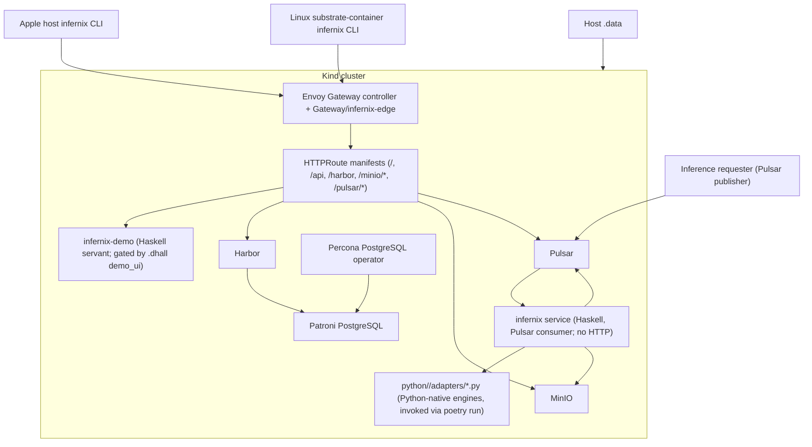

# Infernix Development Plan - Overview

**Status**: Authoritative source
**Referenced by**: [README.md](README.md), [system-components.md](system-components.md)

> **Purpose**: Capture the architecture baseline, hard constraints, control-plane topology,
> runtime-mode contract, and canonical repository shape that every `infernix` phase depends on.

## Current Repo Assessment

The supported platform contract is described in present-tense declarative language throughout the
plan. The repository carries a previous Python-HTTP and JavaScript-workbench implementation of
several surfaces (tracked in [legacy-tracking-for-deletion.md](legacy-tracking-for-deletion.md))
while the supported doctrine described below is being landed across phases 1, 3, 4, and 5. Phase 0
is closed; the remaining open work is implementation migration and validation-surface retargeting,
not documentation-suite bootstrap.

| Area | Doctrine status | Current supported contract details |
|------|-----------------|------------------------------------|
| Development plan and docs suite | realigned baseline closed | The documentation suite, root README, AGENTS, and CLAUDE now describe the two-binary, Pulsar-production, PureScript-demo-UI, per-substrate-Python-adapter doctrine declared in this overview; later phases now retire the remaining legacy implementation and hygiene surfaces |
| Production daemon and Pulsar inference | partial implementation | `infernix service` no longer binds HTTP and now delegates to the split runtime modules under `src/Infernix/Runtime/{Pulsar,Worker,Cache}.hs`; `Pulsar.hs` is still a no-subscription placeholder, and the worker now resolves engine-specific Python adapters over typed protobuf-over-stdio but those adapters are still stub responders rather than real engine loaders |
| Demo UI host | present | `infernix-demo` is a separate Haskell executable sharing `infernix-lib`. It exposes the demo HTTP API surface (`/`, `/api`, `/api/publication`, `/api/cache`, `/objects/`) via servant, is used by the host bridge and supported simulated path, and is now deployed on the real cluster through the Helm-gated `infernix-demo` workload driven by the active `.dhall` `demo_ui` flag |
| Edge routing and platform portals | doctrine realignment underway | Routing now lands through Envoy Gateway API: the worktree carries the Envoy Gateway chart dependency, `GatewayClass/infernix-gateway`, `Gateway/infernix-edge`, and one HTTPRoute manifest per public path. The legacy Haskell routing modules and edge templates are deleted from the worktree, but real-cluster Gateway or HTTPRoute acceptance and publication-state de-duplication are still open in Phases 3 and 6. The demo cluster is local-only, so no auth filters apply |
| Kind and Helm assets | present | the Kind or Helm substrate, Harbor-first bootstrap sequencing, stable Harbor bootstrap and final render material, node-reachable `localhost:30002` registry-mirror config, Kind-worker prefetch of Harbor-backed final image refs, final-phase Pulsar initialization, loopback-only outer-container host bindings, the private Docker `kind` network plus internal kubeconfig access path, pinned `kindest/node:v1.34.0` node images, claim-aware outer-container storage sync, and the supported-host validated `nvkind` plus device-plugin GPU lane are implemented, and the validated outer-container lane requires host inotify capacity sufficient for mount-bearing Kind nodes |
| PostgreSQL platform substrate | present | every in-cluster PostgreSQL dependency follows the supported Patroni-plus-Percona-operator contract, Harbor disables the chart-managed standalone database path, Harbor's operator-managed claims bind through `infernix-manual`, and repeat cluster lifecycle plus HA validation covers readiness, failover, and PVC rebinding on that substrate |
| Launch and schema assets | doctrine realignment underway | The worktree now carries `compose.yaml`, `docker/linux-base.Dockerfile`, `docker/linux-cpu.Dockerfile`, `docker/linux-cuda.Dockerfile`, `chart/`, `kind/`, and `proto/`; the legacy launcher, service, engine, and web Dockerfiles are deleted from the worktree but still require index cleanup. The shared Linux base image is validated, while the runtime-substrate images and the full prebaked-engine toolchain contract still need closure in Phases 4 and 5 |
| Runtime-mode matrix | present | the full README-scale model, format, and engine matrix drives the generated source of truth; the Haskell worker consumes the selected engine metadata together with the durable artifact-bundle, source-artifact-manifest, and engine-adapter metadata selected for that runtime mode |
| Generated demo config | present | `cluster up` emits mode-specific `infernix-demo-<mode>.dhall`, publishes a real `ConfigMap/infernix-demo-config`, and mounts that ConfigMap into the cluster-resident service, web, and `infernix-demo` workloads |
| Demo UI implementation language | present | PureScript built with spago; `purescript-spec` test framework; generated frontend contracts derived by `infernix internal generate-purs-contracts` through `purescript-bridge` from dedicated Haskell browser-contract ADTs in `src/Generated/Contracts.hs`; build output served from `web/dist/` produced by `spago bundle` |
| Custom-logic Python tooling | doctrine realignment underway | Repo-owned custom platform logic, cluster helpers, and lint helpers are Haskell-owned. The Python surface lives only at `python/<substrate>/adapters/*.py`, governed by per-substrate `pyproject.toml` files and invoked exclusively through `poetry run`. The single quality entrypoint is `poetry run check-code` (mypy strict, black check, ruff strict). Per-engine Poetry console scripts (`setup-<engine>`, adapter entrypoints) replace raw `python <script>` invocation. The legacy shell shims are deleted from the worktree, while real engine loaders and version-control hygiene remain open |
| Tests | present (gates retain shape; implementation pointers are being re-targeted) | lint, unit, exhaustive integration, and routed E2E entrypoints retain their validation contract; pointers shift from Python-implemented surfaces to Haskell modules and `purescript-spec` suites as the upstream sprints land |

## Supported Outcome

`infernix` is a Kind-forward local inference platform that:

- ships two Haskell executables sharing one Cabal library `infernix-lib`: `infernix` for the
  production daemon, cluster lifecycle, Pulsar inference dispatcher, static-quality gate, and
  internal helpers; and `infernix-demo` for the demo UI HTTP host (gated by the active `.dhall`
  `demo_ui` flag). All routing is owned by the Helm-installed Envoy Gateway controller plus
  repo-owned HTTPRoute manifests; `infernix` itself is no longer a routing process
- uses one Kind cluster as the supported local substrate
- deploys Harbor, MinIO, Pulsar, and every required PostgreSQL backend through one Helm-owned
  cluster path, with PostgreSQL always delivered as Patroni clusters managed by the Percona
  Kubernetes operator
- deploys Harbor first through Helm on a pristine cluster, letting Harbor and only Harbor-required
  backend services such as MinIO and PostgreSQL pull from public container repositories while
  Harbor is not yet running
- waits to roll out every remaining non-Harbor workload until Harbor is reachable enough to serve pulls
- uses local Harbor as the image source for every non-Harbor cluster pod, add-on, and later Helm
  rollout after Harbor bootstrap completes
- deletes default storage classes and relies only on a manual `kubernetes.io/no-provisioner`
  storage class for every PVC-backed Helm workload
- creates PVs manually under `./.data/`, explicitly binds them to durable PVCs, and applies that
  rule to operator-managed PostgreSQL claims as well as direct chart-owned stateful workloads
- serves the demo UI from `infernix-demo`, deployed as a separate cluster workload built from the
  same OCI image, in every supported runtime mode that opts into the demo surface; the demo UI
  itself is implemented in PureScript and served from `web/dist/` produced by `spago bundle`
- exposes the demo UI, demo API, Harbor, MinIO, and Pulsar browser surfaces through one
  Envoy-Gateway-owned localhost listener (`Gateway/infernix-edge`) plus one HTTPRoute manifest
  per public path; the demo cluster runs locally and applies no auth filters; the production
  inference surface is Pulsar topics named in the active `.dhall`, not HTTP
- accepts production inference work by Pulsar subscription only: `infernix service` consumes
  protobuf requests from configured request topics, dispatches them through the Haskell worker,
  and publishes results to configured result topics, with no HTTP listener bound
- restricts Python to `python/<substrate>/adapters/*.py` (Poetry-managed; per-substrate
  `pyproject.toml`; the canonical quality entrypoint is `poetry run check-code` running mypy
  strict, black check, and ruff strict in sequence); per-engine setup work runs through
  `poetry run setup-<engine>` console scripts; all custom platform logic is Haskell
- keeps Haskell types authoritative for frontend contracts through
  `infernix internal generate-purs-contracts` and verifies the frontend through `purescript-spec`
  plus routed Playwright coverage
- supports `linux-cuda` only through a GPU-enabled Kind cluster path that exposes NVIDIA container
  runtime support and `nvidia.com/gpu` resources to cluster workloads
- stages the active runtime mode's demo catalog as `infernix-demo-<mode>.dhall` during `cluster up`
  and publishes it into `ConfigMap/infernix-demo-config`
- derives the demo UI catalog, service runtime bindings, and integration or E2E enumeration from
  that ConfigMap-backed mounted `.dhall` file for the active mode
- defines runtime manifests and Pulsar payloads in repo-owned `.proto` schemas, using
  `proto-lens` for Haskell bindings and Pulsar's built-in protobuf schema support for topic payloads
- enforces static quality through `infernix test lint`, starting with repo-owned lint, docs, and
  strict compiler-warning checks and permitting a richer formatter or linter stack once it is
  actually adopted
- runs Playwright from the per-substrate container on Linux substrates (which also serves the
  web UI bundle), and from the operator's host node install on Apple Silicon
- collapses every Linux Dockerfile into one custom container per substrate (`linux-cpu`,
  `linux-cuda`) on `ubuntu:24.04` (or `nvidia/cuda:<…>-cudnn-runtime-ubuntu24.04` for CUDA),
  with ghcup-pinned GHC 9.14.1 + Cabal 3.16.1.0, Python 3 + Poetry, gcc 15.2, and the Kind
  toolbelt baked in. Inside the substrate container the daemon never invokes `apt`, `pip`, or
  any compiler; the Dockerfile owns the toolchain. Apple Silicon has no Dockerfile — the
  operator pre-installs ghcup with GHC 9.14.1 + Cabal 3.16.1.0 active, then `cabal build`
  produces working binaries and the daemon installs C/C++ engine deps via system `clang` and
  `brew`
- carries no tracked repo-owned `.sh` sources and commits no built artifacts (`poetry.lock`,
  generated proto, `.mypy_cache`, `.ruff_cache`, `*.pyc`, `web/dist/`, `web/spago.lock`,
  `web/src/Generated/`); `.gitignore` and `.dockerignore` mirror each other for that ignore set

## Topology Baseline

The supported topology is below. Routing is owned by the Helm-installed Envoy Gateway controller
plus one `Gateway/infernix-edge` resource bound to the chosen localhost port; HTTPRoute manifests
attached to that Gateway expose the demo, Harbor, MinIO, and Pulsar surfaces with `URLRewrite`
filters per backend. The demo cluster runs locally and applies no auth filters. Every PostgreSQL
dependency runs through the Percona Kubernetes operator plus Patroni-managed PostgreSQL clusters;
Harbor follows that same operator-managed path on the supported cluster lifecycle.



## Canonical Repository Shape

The repository layout authority moves here from `README.md`. The current canonical shape includes
these core assets and directories:

```text
infernix/
├── DEVELOPMENT_PLAN/
├── documents/
│   ├── README.md
│   ├── documentation_standards.md
│   ├── architecture/
│   ├── development/
│   ├── engineering/
│   ├── operations/
│   ├── reference/
│   ├── tools/
│   └── research/
├── AGENTS.md
├── CLAUDE.md
├── README.md
├── Setup.hs
├── compose.yaml
├── infernix.cabal
├── cabal.project
├── app/
│   ├── Main.hs            (entry point for `infernix`)
│   └── Demo.hs            (entry point for `infernix-demo`)
├── src/
│   ├── Generated/
│   │   └── Contracts.hs        (purescript-bridge-owned browser-contract ADTs)
│   └── Infernix/
│       ├── CLI.hs
│       ├── Cluster/
│       │   ├── Discover.hs
│       │   └── PublishImages.hs
│       ├── Cluster.hs
│       ├── Config.hs
│       ├── Demo/
│       │   └── Api.hs
│       ├── DemoConfig.hs
│       ├── Engines/
│       │   └── AppleSilicon.hs (daemon-driven brew + clang engine bootstrap)
│       ├── Lint/
│       │   ├── Chart.hs
│       │   ├── Docs.hs
│       │   ├── Files.hs
│       │   ├── HaskellStyle.hs
│       │   └── Proto.hs
│       ├── Models.hs
│       ├── Runtime/
│       │   ├── Cache.hs
│       │   ├── Pulsar.hs
│       │   └── Worker.hs
│       ├── Runtime.hs
│       ├── Service.hs
│       ├── Storage.hs
│       └── Types.hs
├── proto/
│   └── infernix/
│       ├── api/
│       ├── manifest/
│       └── runtime/
├── python/
│   ├── apple-silicon/
│   │   ├── pyproject.toml     (Poetry-managed; declares console scripts for the Apple column;
│   │   │                       creates a repo-local .venv on demand on the host)
│   │   └── adapters/*.py      (flat adapter modules plus shared helpers)
│   ├── linux-cpu/
│   │   ├── pyproject.toml     (system-wide Poetry install inside the linux-cpu container)
│   │   └── adapters/*.py
│   └── linux-cuda/
│       ├── pyproject.toml     (system-wide Poetry install inside the linux-cuda container)
│       └── adapters/*.py
├── web/
│   ├── spago.yaml
│   ├── src/
│   │   ├── *.purs
│   │   └── Generated/     (build-time generated PureScript contracts)
│   ├── test/
│   │   └── *.purs         (purescript-spec suites)
│   └── playwright/
├── chart/
│   └── templates/
│       ├── gatewayclass.yaml      (Envoy Gateway API GatewayClass)
│       ├── gateway.yaml           (Gateway/infernix-edge bound to chosen localhost port)
│       └── httproutes/            (one HTTPRoute per public path, with URLRewrite filters)
├── kind/
├── docker/
│   ├── linux-base.Dockerfile      (shared substrate base layer)
│   ├── linux-cpu.Dockerfile       (FROM ubuntu:24.04)
│   └── linux-cuda.Dockerfile      (FROM nvidia/cuda:<…>-cudnn-runtime-ubuntu24.04)
├── tools/
│   └── generated_proto/           (auto-generated protobuf stubs; regenerated, not committed)
├── test/
│   ├── integration/
│   │   └── Spec.hs
│   └── unit/
│       └── Spec.hs
├── .build/
└── .data/
```

## Execution Contexts and Runtime Modes

The plan keeps control-plane execution context separate from runtime mode.

### Control-Plane Execution Contexts

| Context | Canonical launcher | Purpose |
|---------|--------------------|---------|
| Apple host-native control plane | `./.build/infernix ...` | direct host execution on Apple Silicon |
| Linux outer-container control plane | `docker compose run --rm infernix infernix ...` | containerized Linux launcher with Docker socket forwarding |

### Runtime Modes

| Runtime mode | Canonical mode id | Engine column from README matrix | Typical role |
|--------------|-------------------|----------------------------------|--------------|
| Apple Silicon / Metal | `apple-silicon` | `Best Apple Silicon engine` | Apple-native runtime parity and local development |
| Ubuntu 24.04 / CPU | `linux-cpu` | `Best Linux CPU engine` | CPU-only validation and fallback execution |
| Ubuntu 24.04 / NVIDIA CUDA Container | `linux-cuda` | `Best Linux CUDA engine` | CUDA-backed high-throughput execution |

The control-plane execution context decides where `infernix` runs. The runtime mode decides which
engine binding is selected for each matrix row, which generated demo `.dhall` content is staged and
published, and which catalog entries integration and E2E tests must cover.

## Hard Constraints

### 0. Documentation-First Construction Rule

Phase 0 creates and maintains the governed `documents/` suite before later phases can close.

- While Phase 0 is open, later phases remain blocked at the phase level.
- The repository README stays an orientation document and does not re-absorb the canonical rules
  that Phase 0 moves into `documents/`.

### 1. Two Haskell Executables Sharing One Library

The repo ships two Haskell executables built from one Cabal library named `infernix-lib`:

- `infernix` is the production daemon. It owns the CLI surface for cluster lifecycle (`infernix cluster ...`), the Pulsar-subscribed inference dispatcher (`infernix service`), the static-quality gate (`infernix lint`, `infernix test ...`), and internal build helpers (`infernix internal ...`). In production mode it binds no HTTP listener. Routing is owned by the Helm-installed Envoy Gateway controller plus repo-owned HTTPRoute manifests; `infernix` itself runs no edge-proxy or per-backend gateway process.
- `infernix-demo` is the demo UI host. It exposes a servant-based HTTP server that serves `/`, `/api`, `/api/publication`, `/api/cache`, and `/objects/` for the demo workbench. It is invoked through `infernix-demo serve --dhall PATH --port N` and is gated by the active `.dhall` `demo_ui` flag; production deployments leave the flag off.

Both executables ship in the same per-substrate OCI image; the chart workload entrypoint selects which exe runs. No third repo-owned Haskell executable or launcher script exists for tests, bootstrap, or sidecar helpers.

### 2. Dual Control-Plane Execution Contexts

The supported local operator surface is platform-sensitive:

- Apple Silicon: `./.build/infernix` is the canonical host-native operator surface. It shells out
  to host-installed `kind`, `kubectl`, `helm`, and Docker for the real Kind and Helm lifecycle.
- Apple Silicon host builds place the compiled binary and other generated build artifacts under
  `./.build/`.
- On Apple Silicon, `cluster up` writes the repo-local kubeconfig to `./.build/infernix.kubeconfig`
  and must not mutate `$HOME/.kube/config` or the user's global current context.
- `infernix kubectl ...` is the supported wrapper for Kubernetes access and automatically targets
  the repo-local kubeconfig under `./.build/`.
- On Apple Silicon, the operator workflow has no Python prerequisite. Poetry and a local
  virtual environment materialize only when the Python adapter validation surface is exercised
  explicitly (for example `infernix test unit` or `infernix test all`). `infernix` does not
  install Poetry as a generic
  platform prerequisite.
- Containerized Linux: `docker compose run --rm infernix infernix ...` is the supported launcher,
  with the Docker socket forwarded and the repo working tree, including `./.data/`, bind mounted.

The distinction is about where `infernix` runs, not whether Kind uses containers. Kind still
depends on Docker in both execution contexts.

### 3. Three Supported Runtime Modes

The supported product contract always names all three runtime modes:

- `apple-silicon`
- `linux-cpu`
- `linux-cuda`

No plan document treats Linux CPU and Linux CUDA as one undifferentiated "Linux mode". The engine
binding for a model or workload comes from the runtime mode's column in the README matrix.

### 3a. `linux-cuda` Requires GPU-Enabled Kind

`linux-cuda` is not just a model-selection flag. It changes the Kind substrate.

- `cluster up` in `linux-cuda` reconciles a GPU-capable Kind cluster path that exposes NVIDIA
  container runtime support inside the Kind node containers.
- `cluster up` fails fast in `linux-cuda` unless the host passes the NVIDIA preflight contract for
  `nvidia-smi`, Docker `--gpus all`, and the NVIDIA worker-device volume-mount path used by the
  Kind worker.
- The Kubernetes node inventory advertises `nvidia.com/gpu` resources through the NVIDIA device
  plugin or an equivalent supported mechanism.
- CUDA workloads request `nvidia.com/gpu` and use repo-owned runtime or scheduling configuration,
  such as `runtimeClassName: nvidia` when needed by the chosen implementation.

### 4. Generated Mode-Specific Demo `.dhall` and ConfigMap Publication

`cluster up` generates one demo catalog for the active runtime mode.

- The generated filename is `infernix-demo-<mode>.dhall`.
- Apple host mode may stage the file under `./.build/` when the host-native daemon path needs it.
- Outer-container Linux stages the file ephemerally only long enough to create or update the
  cluster ConfigMap.
- The file enumerates every model or workload row supported in the active mode.
- Each entry carries the matrix-row identity, artifact or format family, selected engine, request
  or result contract identifiers, and runtime-lane metadata needed by the service, UI, and tests.
- `cluster up` creates or updates `ConfigMap/infernix-demo-config` from that generated content.
- In containerized execution contexts, cluster-resident service, webapp, and `infernix-demo`
  workloads mount `ConfigMap/infernix-demo-config` read-only at `/opt/build/`.
- The daemon looks for the active-mode `.dhall` in the same folder as its binary and actively
  watches it there for changes.
- Rows whose selected mode column is `Not recommended` are omitted from that mode's generated
  catalog.
- Across the three runtime modes, the full set of generated files covers every row in the README
  matrix.

### 5. Manual Storage Doctrine

Persistent local state is explicit and deterministic.

- Default storage classes are deleted on cluster bootstrap.
- The only supported storage class is a manual no-provisioner class, tentatively named
  `infernix-manual`.
- Every PVC-backed Helm workload, including operator-managed durable claims reconciled from a
  repo-owned Helm release, explicitly sets `storageClassName: infernix-manual`.
- Durable PVs are created manually only by the storage-reconciliation step inside
  `infernix cluster up` and bind explicitly to their intended claims.
- Each durable PV maps into `./.data/kind/<namespace>/<release>/<workload>/<ordinal>/<claim>`.

### 5a. Protobuf Manifest and Event Contract

Runtime manifests and Pulsar topic payloads are schema-owned artifacts, not ad hoc JSON blobs.

- Repo-owned `.proto` files under `proto/` define the authoritative wire format for runtime
  manifests and Pulsar-carried inference lifecycle payloads.
- Haskell runtime code consumes those schemas through generated `proto-lens` modules rather than
  handwritten duplicate encoders and decoders.
- Pulsar topics carrying those payloads use Pulsar's built-in protobuf schema support rather than
  untyped byte arrays.
- Durable runtime manifests stored in MinIO serialize from the same `.proto` contract used by the
  service runtime.

### 5b. Operator-Managed PostgreSQL Doctrine

In-cluster PostgreSQL is standardized and never delegated to ad hoc chart defaults.

- Every in-cluster PostgreSQL requirement uses a Patroni cluster managed by the Percona Kubernetes
  operator.
- A service may use a dedicated PostgreSQL cluster, but it still uses the same Percona plus
  Patroni model rather than a self-deployed standalone PostgreSQL chart path.
- Services or add-ons that can optionally self-deploy PostgreSQL, such as Grafana or similar
  workloads, disable that embedded PostgreSQL path and target an operator-managed cluster instead.
- PostgreSQL claims follow the same `infernix-manual` plus explicit PV-binding storage doctrine as
  every other durable cluster workload.

### 6. Cluster-Resident Demo UI

The demo UI host runs on the Kind cluster in a container, gated by the active `.dhall`
`demo_ui` flag.

- The demo UI host is the `infernix-demo` Haskell executable, deployed as the `infernix-demo`
  cluster workload via `chart/templates/deployment-demo.yaml`.
- On Linux substrates, the per-substrate OCI image carries both `infernix` and `infernix-demo`
  along with the spago-bundled PureScript front-end under `web/dist/` and Playwright + the
  browser deps; the chart workload entrypoint selects which exe runs. On Apple Silicon there
  is no Dockerfile — the operator runs `cabal build` against ghcup-installed GHC/Cabal and
  Playwright runs from the host node install.
- The stable browser entrypoint is always the Envoy `Gateway/infernix-edge` listener when the
  demo surface is enabled.
- Production deployments leave `demo_ui` off in the active `.dhall`; the `infernix-demo`
  workload is then absent and the cluster has no HTTP API surface at all.
- The `infernix-demo` workload is owned by repo Helm chart templates; there is no separate
  web image.

### 7. Local Harbor Is The Cluster Image Source

Local Harbor is the required image authority once Harbor bootstrap completes.

- `infernix cluster up` installs Harbor through Helm first, and Harbor plus the storage or support
  services Harbor needs during bootstrap, including MinIO and PostgreSQL, may pull directly from
  public container repositories while Harbor is not running yet.
- No remaining non-Harbor workload rolls out before Harbor is reachable enough to serve pulls.
- Once Harbor is ready, every remaining non-Harbor cluster pod, add-on, or later Helm deployment
  pulls from local Harbor.
- `infernix cluster up` mirrors required non-Harbor third-party images and builds repo-owned
  images for the active runtime mode (the per-substrate image from `docker/linux-cpu.Dockerfile`
  or `docker/linux-cuda.Dockerfile` on Linux substrates; nothing built on Apple Silicon), then
  publishes them to Harbor before the final non-Harbor Helm rollout begins.

### 7a. Mandatory Local HA Service Topology

The supported cluster path always deploys the HA service layout.

- Harbor application-plane workloads use three replicas where the chosen chart exposes replicated
  application services.
- MinIO always deploys as a four-node distributed cluster.
- Pulsar durable HA components use three replicas where the chosen chart exposes those HA surfaces.
- Every PostgreSQL-backed service uses an operator-managed Patroni cluster instead of a
  chart-managed standalone PostgreSQL deployment.
- Repo-owned Helm values explicitly suppress hard pod anti-affinity and equivalent hard scheduling
  constraints that would otherwise block these replicas from scheduling on local Kind.
- There is no supported single-replica dev profile and no CLI flag that opts out of the mandatory
  local HA topology.

### 8. Stable Edge Port and Route Prefixes via Envoy Gateway API

All browser-visible and host-consumed cluster portals share one loopback port owned by the
Envoy Gateway controller and the `Gateway/infernix-edge` resource.

- The CLI tries `9090` first and increments by 1 until it finds an available localhost port
  during cluster startup; the rendered `Gateway` listener uses that port.
- The chosen port is recorded under `./.data/runtime/edge-port.json`.
- `cluster up` prints the chosen port to the operator during bring-up.
- One HTTPRoute manifest per public path (`/`, `/api`, `/objects`, `/harbor`, `/minio/console`,
  `/minio/s3`, `/pulsar/admin`, `/pulsar/ws`) is attached to the `infernix-edge` Gateway with
  the appropriate `URLRewrite` filter; the demo HTTPRoutes (`/`, `/api`, `/api/publication`,
  `/api/cache`, `/objects`) are absent when the active `.dhall` `demo_ui` flag is off.
- Apple host-native `infernix` reaches Harbor, MinIO, Pulsar, and the demo HTTP host through
  the same Gateway listener.
- The demo cluster runs locally and applies no auth filters.

### 8a. `cluster up` Is A Test-Cluster Bring-Up Flow

The supported `cluster up` flow exists to provision the test cluster used by repository validation
workflows.

- `cluster up` auto-generates the active runtime mode's demo `.dhall` configuration.
- `cluster up` uploads that generated content into `ConfigMap/infernix-demo-config` for
  cluster-resident consumers.
- `cluster up` also writes the repo-local kubeconfig used by supported `infernix kubectl` flows.
- The generated configuration enables every README-matrix row supported by the active mode under
  test.
- The generated `.dhall` staging file is a build artifact, not tracked source, and lives only as
  staging content in the build output location for the active execution context.

### 8b. Integration and E2E Cover The Entire Active-Mode Catalog

Mode-aware coverage is exhaustive by default.

- `infernix test integration` for a runtime mode exercises every entry present in that mode's
  mounted ConfigMap-backed demo `.dhall`.
- `infernix test e2e` for a runtime mode exercises every demo-visible entry present in that same
  file through the routed surface; the current implementation covers both exhaustive routed HTTP
  execution and real browser UI interaction through the built web image, and the current
  host-native final-substrate lane reuses the Harbor-published web image for that same executor
  path.
- The selected engine for each tested entry matches the appropriate runtime-mode column from the
  README matrix because the mounted ConfigMap-backed `.dhall` file encodes that binding.

### 9. Haskell Types Own Frontend Contracts

Haskell ADTs are the SSOT for the frontend contract.

- The supported web build generates a `Generated.Contracts` PureScript module from Haskell-owned
  catalog and DTO records through `infernix internal generate-purs-contracts`, using
  `purescript-bridge` plus dedicated browser-contract ADTs in `src/Generated/Contracts.hs`.
- The supported demo UI consumes those generated PureScript modules from `web/src/Generated/` and
  does not maintain hand-authored duplicate request or response types.
- The supported codegen entrypoint is `infernix internal generate-purs-contracts`, invoked by
  `npm --prefix web run build`; no separate public frontend codegen command exists.
- `infernix test unit` runs `spago test` (`purescript-spec`) alongside the Haskell unit suites,
  and `infernix test e2e` proves the demo UI stays aligned with the Haskell-owned contract through
  routed Playwright coverage.

### 10. Playwright Lives In The Substrate Container (Linux) or On The Host (Apple Silicon)

Playwright is installed in the same per-substrate container image that carries the built web
bundle and the Haskell binaries on Linux substrates. Apple Silicon has no substrate container,
so Playwright runs from the operator's host node install.

- On `linux-cpu` and `linux-cuda`, the Dockerfile installs Chromium, WebKit, and Firefox plus
  Playwright system deps, alongside the spago-bundled `web/dist/` bundle. The same image plays
  launcher, in-cluster workload, and E2E executor.
- On `apple-silicon`, `infernix test e2e` invokes `npx playwright test` against the host's
  node install; the operator pre-installs the browsers via `npx playwright install`.
- No separate `web/Dockerfile`-built image exists.

### 11. Container Build Output Stays Under `/opt/build`

Containerized builds keep generated artifacts out of the bind-mounted repo tree.

- Supported outer-container runtime `cabal` invocations pass `--builddir=/opt/build/infernix`
  explicitly so runtime container artifacts land under `/opt/build/infernix`.
- Supported container Cabal workflows use `/opt/build/infernix` as the build root.
- The validated Compose launcher uses the image-installed `infernix` binary and keeps
  container-side runtime build output under `/opt/build/infernix`.
- Unqualified bare `cabal` invocations are not allowed to recreate `dist-newstyle/` or any other
  build output under the mounted repository during supported container workflows.
- The repo-owned CLI or container entrypoint contract must enforce this behavior rather than
  relying on contributor discipline alone.

### 12. Apple Host Build Output Stays Under `./.build`

Apple host-native builds keep generated artifacts under the repo-local `./.build/` directory.

- The current implementation achieves this through direct
  `cabal --builddir=.build/cabal install --installdir=./.build --install-method=copy --overwrite-policy=always exe:infernix exe:infernix-demo`
  host builds plus `./.build/infernix` and `./.build/infernix-demo` materialization, and the
  supported path does not include repo-owned scripts or wrappers.
- Supported Apple host-native command examples use `./.build/infernix ...` and
  `./.build/infernix-demo ...`.
- The generated mode-specific demo `.dhall` files for host-side `cluster up` live under
  `./.build/`.
- The Apple host-native kubeconfig for supported cluster access lives at `./.build/infernix.kubeconfig`.
- `./.build/` is ignored by Git and excluded from Docker build context.

### 13. Python Restriction

Python is permitted only under `python/<substrate>/adapters/*.py` and only when the bound
inference engine has no non-Python binding.

- All custom platform logic, including cluster lifecycle, the demo UI HTTP host, build helpers,
  lint, chart discovery, image publishing, demo-config parsing, and doc validation, is Haskell.
  Routing is delegated to the Envoy Gateway controller plus repo-owned HTTPRoute manifests;
  `infernix` itself owns no proxy process.
- Python is governed by per-substrate `pyproject.toml` files (`python/apple-silicon/pyproject.toml`,
  `python/linux-cpu/pyproject.toml`, `python/linux-cuda/pyproject.toml`); a single root
  `python/pyproject.toml` is the preferred form when (and only when) a single resolution
  satisfies every engine in scope. Poetry optional groups (`[tool.poetry.group.<engine>]`) are
  the supported tool when engines coexist in one resolution but only some are installed per
  lane.
- On Apple Silicon, `poetry install --directory python/apple-silicon` materializes a repo-local
  `.venv`. On Linux substrates, the substrate Dockerfile runs `poetry install` system-wide
  (`POETRY_VIRTUALENVS_CREATE=false`) at image build time; the in-container daemon never
  re-runs Poetry, never invokes `apt`/`pip`, and never compiles.
- Every Python invocation goes through `poetry run`. The single quality entrypoint is
  `poetry run check-code`, declared as a Poetry console script that runs mypy strict, black
  check, and ruff strict in sequence. Per-engine setup work runs through additional Poetry
  console scripts (`setup-<engine>`) the daemon shells out to.
- `tools/` carries only auto-generated stubs in `tools/generated_proto/` (regenerated by
  build, gitignored). The repo carries no tracked repo-owned `.sh` sources; `tools/python_quality.sh`
  and `scripts/install-formatter.sh` are removed from the worktree.

### 14. Production Surface Is Pulsar-Only

Production deployments accept inference work by Pulsar subscription only.

- `infernix service` (production) subscribes to request topics named in the active `.dhall`,
  dispatches each request through the Haskell worker (`src/Infernix/Runtime/Worker.hs`), and
  publishes results to result topics named in the same config. The active `.dhall` schema names
  `request_topics : List Text`, `result_topic : Text`, and `engines : List EngineBinding`.
- The HTTP listener is provided exclusively by `infernix-demo` and is gated by the `.dhall`
  `demo_ui` flag. `infernix` (production) binds no HTTP port.
- The general use case is: deploy one or more `infernix` instances via a `.dhall` config; request
  inference by publishing protobuf messages to the configured request topics; `infernix` knows
  what to do with results from the same config.

### 15. Frontend Language Is PureScript

The demo UI is PureScript.

- Source modules live under `web/src/*.purs`. The web build uses `spago build` and
  `spago bundle`; PureScript replaces the prior browser workbench and its legacy Node-based
  bundling path.
- Frontend types are emitted into `web/src/Generated/Contracts.purs` by
  `infernix internal generate-purs-contracts`, which derives the PureScript newtypes via
  `purescript-bridge` from dedicated browser-contract ADTs in `src/Generated/Contracts.hs` and
  appends the active-mode runtime constants used by the demo UI.
- Frontend tests use `purescript-spec` and live under `web/test/*.purs`; `spago test` runs them
  and `infernix test unit` invokes `spago test` alongside the Haskell unit suites.
- JavaScript may exist only as compiled output of `spago bundle` under `web/dist/`. No
  source-level `.js` files are part of the supported browser application surface; `web/package.json`
  remains the supported manifest for npm-distributed PureScript and Playwright dependencies.

## Command Surface Baseline

The canonical supported CLI surface is:

| Command | Contract |
|---------|----------|
| `infernix service` | long-running daemon entrypoint; in production it is a Pulsar consumer that subscribes to request topics named in the active `.dhall` and dispatches each request through the Haskell worker, with no HTTP listener bound; the only supported surface that is not idempotent by design |
| `infernix cluster up` | declaratively reconcile the supported Kind, Helm, HA, image-flow, and active-mode demo-config contract |
| `infernix cluster down` | declaratively reconcile cluster absence while preserving authoritative repo data under `./.data/` |
| `infernix cluster status` | read-only status and route report, including chosen edge port and demo-config publication details; never mutates cluster or repo state |
| `infernix cache status` | declaratively report the manifest-backed derived cache inventory for the active runtime mode without rewriting runtime or publication state |
| `infernix cache evict` | declaratively remove derived cache state for the active runtime mode without mutating durable manifests, generated catalog state, or publication state |
| `infernix cache rebuild` | declaratively rebuild derived cache state for the active runtime mode from durable manifests without mutating generated catalog state or publication state |
| `infernix kubectl ...` | Kubernetes-access wrapper that preserves the repo-local kubeconfig contract while delegating the remaining arguments to upstream `kubectl` |
| `infernix lint files`, `infernix lint docs`, `infernix lint proto`, `infernix lint chart` | declaratively execute the canonical file, documentation, protobuf, and Helm chart static checks (Haskell modules under `src/Infernix/Lint/`) |
| `infernix test lint` | declaratively execute the canonical lint, docs, Helm chart, compiler-warning, and Python adapter quality (mypy strict, black, ruff strict) checks |
| `infernix test unit` | declaratively execute unit validation, including Haskell unit suites and `spago test` for `purescript-spec` |
| `infernix test integration` | declaratively execute integration validation for the active runtime mode, reusing or reconciling supported prerequisites as needed |
| `infernix test e2e` | declaratively execute routed Playwright validation for the active runtime mode through the built web image, including Harbor-published image reuse on the host-native final-substrate lane |
| `infernix test all` | declaratively execute the full supported validation stack for the active runtime mode, aggregating lint, unit, integration, and E2E checks |
| `infernix docs check` | declaratively validate the documentation suite and development-plan cross-references |
| `infernix internal generate-purs-contracts` | emit the build-generated PureScript contract module into `web/src/Generated/` from the dedicated bridge-owned Haskell contract surface |
| `infernix internal discover images`, `infernix internal discover claims`, `infernix internal discover harbor-overlay` | declaratively discover container image references, persistent volume claims, and Harbor overlay images from chart templates |
| `infernix internal publish-chart-images` | declaratively build and publish repo-owned images to Harbor; folds into `infernix cluster up` |
| `infernix internal demo-config load`, `infernix internal demo-config validate` | declaratively load and validate the active mode's `.dhall` demo config without mutating cluster or repo state |
| `infernix-demo serve --dhall PATH --port N` | long-running entrypoint for the `infernix-demo` binary; serves the demo HTTP API surface; gated by the `.dhall` `demo_ui` flag and absent from production deployments |

Every supported lifecycle, validation, and docs command except `infernix service` is declarative
and idempotent. `infernix cache ...` operates only on manifest-backed derived cache state and does
not rewrite the generated catalog or publication contract. `infernix kubectl ...` is a scoped
Kubernetes-access wrapper around upstream `kubectl`, and it is not a parallel lifecycle command
family. The plan does not introduce alternate imperative helper command families for storage,
image preparation, or test setup.

## Completion Rules

- A phase is complete only when the target behavior exists and the listed validation gates pass.
- The README does not become the architecture source again for repository layout once this plan exists.
- When topology changes, update [README.md](README.md), [system-components.md](system-components.md),
  and the owning phase file together.

## Cross-References

- [README.md](README.md)
- [system-components.md](system-components.md)
- [phase-0-documentation-and-governance.md](phase-0-documentation-and-governance.md)
- [phase-1-repository-and-control-plane-foundation.md](phase-1-repository-and-control-plane-foundation.md)
- [phase-2-kind-cluster-storage-and-lifecycle.md](phase-2-kind-cluster-storage-and-lifecycle.md)
- [phase-3-ha-platform-services-and-edge-routing.md](phase-3-ha-platform-services-and-edge-routing.md)
- [phase-4-inference-service-and-durable-runtime.md](phase-4-inference-service-and-durable-runtime.md)
- [phase-5-web-ui-and-shared-types.md](phase-5-web-ui-and-shared-types.md)
- [phase-6-validation-e2e-and-ha-hardening.md](phase-6-validation-e2e-and-ha-hardening.md)
