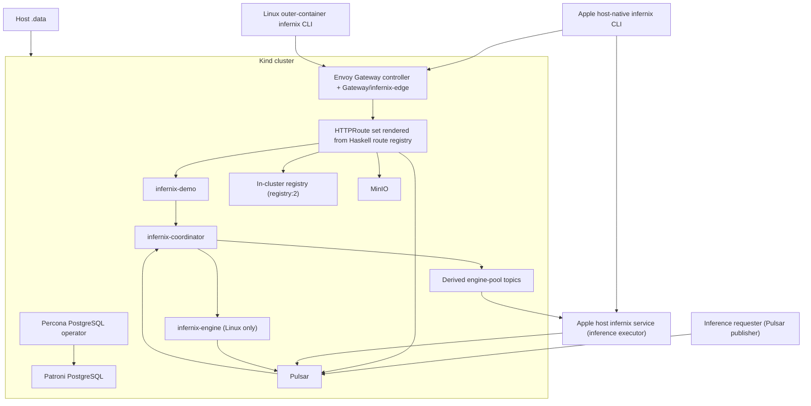

# Infernix Development Plan - Overview

**Status**: Authoritative source
**Referenced by**: [README.md](README.md), [system-components.md](system-components.md)

> **Purpose**: Capture the architecture baseline, hard constraints, control-plane topology,
> substrate contract, and canonical repository shape that every `infernix` phase depends on.

## Architecture Baseline

Beyond the application admin overview and personal dashboard, no general observability stack is
deployed. Monitoring is not a supported first-class surface.

The repository target closes around the explicit-init runtime-config architecture: the one-binary role model,
single-node platform services, registry-first image flow, manual storage doctrine, Pulsar-only
production surface, Gateway-owned routing, Haskell-owned frontend contracts, substrate-specific
validation, and a daemon-role model where the coordinator owns Pulsar routing while
substrate-neutral engine pools run inference on Kubernetes workloads or Apple host daemons.

The host toolchain is an account admitted against the host rather than an unmodelled draw on
headroom. It is drawn from the same claimable pool the inference partition divides, so the two are
alternative occupants admitted one at a time rather than independent declarations, and minting the
account consumes an observation of available host memory plus a census finding no toolchain claimant
outside its own process tree. `Infernix.BuildMemory` makes `deriveBuildMemoryPlan` the only mint of a `BuildMemoryPlan`,
so a per-process ceiling has no inhabitant that was not divided by the job count it is multiplied
by, and the built executable declares a bounded runtime address-space reservation, without which
lowering the process's own `RLIMIT_AS` succeeds and then kills it on its next allocation. The host
manifest carries a measured `memory` record — `/proc/meminfo` intersected with the cgroup maximum on
Linux, `hw.memsize` on Darwin — from which `infernix init` derives the untracked per-machine
`cabal.project.local`, while `cabal.project` carries a calibrated floor for a fresh clone. The
repository-owned CLI spawn boundary is a closed toolchain invocation vocabulary with no
caller-supplied command list, and the Haskell-style lint rejects a raw `HostCabal` spawn that omits
the complete owned lifecycle. The mechanism is resolved per lane and fails closed when it is
unavailable; it is neither a universal `System.Process` guarantee nor a host-global lease. Canonical
doctrine:
[../documents/architecture/bounded_host_memory.md](../documents/architecture/bounded_host_memory.md).

Repository-owned native implementation source is forbidden — in native files, in Cabal
native-source declarations, and in embedded or generated payloads alike. Apple engine
materialization reaches Metal and Core ML through upstream package APIs inside a hidden rank-2
bounded provisioning and session region: a candidate root is hydrated, relocated, authoritatively
smoke-validated, provenance-recorded, and digested from its actual payload before the fsynced
sibling activation transaction, and failure, cancellation, or crash reconciliation preserves a
complete prior root or fails closed. The lifecycle lock, bounded subprocess creation, and
capped-engine process-group custody are all-Haskell over public `filelock`, `process`, and `unix`
APIs with no FFI boundary. Phase 1 Sprint 1.20 owns the removal of the former embedded
Objective-C/C/Metal bridge and its Clang topology; evidence recorded against that bridge describes a
surface the repository no longer has.

## Current Repo Assessment

The architecture below is the target contract, not an assertion that every implementation or
validation obligation is complete. [README.md](README.md#current-phase-overview) owns phase status
and the current finding-to-sprint map. Phase 0 is frozen; follow-on work in Phases 1–9 addresses
validation provenance, lifecycle authority, artifact reality, web containment, memory observation,
durable replay, cancellation, media bounds, configuration generation, and evidence retention.

The existing platform and engine implementations remain the starting point. No code change or
new validation result is implied by the documentation refactor. In particular, a cache marker is
not hydrated model state, a matching prefix hash is not an engine KV cache, rank-2 ordinary
`IO` does not prove lifetime containment, and AST checks cannot prove that output came from a model.

[Open waves](cohort-validation-waves.md#wave-table) separate code-side closure from the chosen
accelerator plus `linux-cpu` sign-off. Phases 2, 3, 5, and 7 lack retained closure tuples and require
recoverable evidence or a rerun. Existing attestations remain unchanged and are not extended to
new work. The [deletion ledger](legacy-tracking-for-deletion.md) names only still-existing
shortcut or compatibility surfaces awaiting removal.

## Supported Outcome

`infernix` targets these rules:

- one repo-owned Haskell executable, `infernix`, sits on top of the default Cabal library exposed
  by the `infernix` package (declared in `infernix.cabal` without an explicit library name and
  depended on as `infernix`): it owns the production daemon, cluster lifecycle, validation, internal
  helpers, and the routed demo HTTP host (served by the long-running `Webapp` daemon role selected
  through typed Dhall and `infernix service --role webapp`)
- one Haskell command registry owns parsing, help text, and the canonical CLI reference. Ordinary
  operations use the initialized substrate; `init` and `test init` retain `--runtime-mode` for
  explicit configuration creation
- the product standardizes three substrates:
  `apple-silicon`, `linux-cpu`, and `linux-gpu`
- the initialized repo-root `./infernix.dhall` is the primary source of
  truth for substrate identity, generated catalog content, inference placement, derived Pulsar
  topics, and validation scope. Daemon role and member identity belong to the machine/process contract
- the initialized runtime config, routed publication surface, `cluster status` output, and generated
  browser contracts currently serialize that active substrate under `runtimeMode` field names even
  though the supported selection contract is substrate-based
- the supported operator config flow is explicit and binary-owned: `infernix init` creates
  `./infernix.dhall` plus `./infernix-host.dhall`, `infernix test init` creates
  `./infernix.test.dhall`, and ordinary config-dependent commands fail fast naming the required
  init rather than auto-materializing a missing file
- the Apple stage-0 `up` wrapper is the deliberate convenience exception: it calls
  `./.build/infernix init --if-missing` before `cluster up`; the Linux image build may use internal
  binary generation for its image-local defaults, but that is not an operator preflight path
- repo-owned shell is limited to the `bootstrap/*.sh` stage-0 host bootstrap surface, which may
  reconcile supported host prerequisites and build or enter the active substrate launcher before
  handing off to the direct `infernix` command surface; shell code must not own Kind, Kubernetes
  manifests, cluster workload image pulls, registry publication, validation internals, or lifecycle
  teardown beyond invoking the binary command
- supported stage-0 bootstrap entrypoints are restartable prerequisite reconcilers: they continue
  in the current process only after verifying the required executable they just installed or
  selected, and they stop at explicit new-shell or reboot boundaries so the operator reruns the
  same bootstrap command instead of jumping ahead to a later direct command
- supported runtime, cluster, cache, Kubernetes-wrapper, frontend-contract generation, and
  aggregate `infernix test ...` entrypoints validate the initialized runtime config and fail fast
  naming the required init if it is absent; focused `infernix lint ...` and `infernix docs check`
  remain config-independent
- the runtime config is a typed Dhall record named `infernix.dhall`, generated by
  `infernix init` or the reservation-gated test harness and decoded in-process by the `dhall`
  library; the schema is reflected from the
  substrate decoder type (`infernix internal dhall-schema substrate`)
- Apple Silicon is the only supported host-native build path outside a container
- on Apple Silicon, the host-built binary manages Kind, deploys the mandatory cluster support
  services, the cluster coordinator daemon, and optional routed demo workload, and still owns the
  host-side same-binary engine daemon lane
- on Apple Silicon, cluster daemons are canonical for Pulsar ingress and derived pool-topic handoff; host
  daemons are canonical for Apple-native inference execution and result publication and consume a
  derived pool/model or pinned-member batch topic using their typed role and membership metadata
- on Linux substrates, coordinators route Pulsar work while assigned engine daemons execute it
  and publish results; webapp daemons do not run inference
- on Linux substrates, all supported CLI commands run through
  `docker compose run --rm infernix infernix ...`; there is no supported Linux host-native CLI
  story outside the outer container
- `linux-cpu` remains the only substrate meaningfully portable across unrelated native Linux host
  hardware; native amd64 Linux and native arm64 Linux are first-class CPU-only host shapes, while
  Apple Silicon emulation is not a supported build or validation path
- `linux-gpu` assumes an amd64 Linux environment paired with a CUDA-capable device, but the outer
  control-plane container itself never requires the NVIDIA runtime
- supported entrypoints no longer use simulated cluster bring-up, direct tool-route compatibility
  handlers, generic inference-success fallback, or cross-substrate default validation reruns; the
  remaining repo-local topic spool is a harness-only path and does not replace real Pulsar
  transport on the routed cluster validation path
- one substrate-aware integration suite traverses the comprehensive model, format, and engine
  matrix in `README.md`, reads the active substrate from `.dhall`, and chooses the corresponding
  engine binding for every supported row or reference
- Playwright E2E is substrate-agnostic at the browser layer and relies on `infernix-demo` reading
  the active `.dhall` to dispatch the correct engine behind the routed demo API
- the routed demo app remains cluster-resident when enabled, and the Apple routed path closes
  around an explicit cluster-daemon-to-host-daemon inference batch bridge rather than
  cluster-resident Apple inference execution
- `infernix init --demo-ui false` can emit `demo_ui = false`; omitting that flag keeps the default
  demo-enabled output
- registry-first bootstrap, Gateway-owned routing, single-node platform services,
  operator-managed Patroni PostgreSQL, manual `infernix-manual` storage, Haskell-owned frontend
  contracts, the shared Python adapter project, and untracked generated outputs all remain
  mandatory doctrine
- supported validation is substrate-specific: integration, E2E, and `test all` run the complete
  supported suites against the built and deployed substrate and report that substrate explicitly
- phase validation is single-accelerator: code-side closure (implementation plus the
  machine-independent gate set) is completed in natural phase order on whichever single machine is
  present and gates the next phase's implementation, while the hardware full-suite for the phase's
  **one** chosen accelerator (`apple-silicon` **or** `linux-gpu`) plus `linux-cpu` gates `Done`; no
  phase requires both accelerators, and cross-accelerator coverage is a `linux-cpu`-only aggregation
  phase that merges committed per-accelerator attestations (see
  [development_plan_standards.md](development_plan_standards.md) Section Q)
- the supported control plane keeps one Haskell command registry,
  imperative cluster or host prerequisite orchestration, root-package in-process Ormolu/HLint plus
  the solver-isolated Cabal-format package,
  and the existing files or docs or chart or proto validation entrypoints rather than layering on
  an additional architecture-doctrine backlog
- every `infernix service` daemon remains startup-configured and Pulsar-driven without a separate
  admin-HTTP, hot-reload, or typed-event-ledger subsystem in the supported contract
- the test surface contains eight root-package Cabal test suites, one solver-isolated Cabal-format
  package suite, and the frontend unit suite: `infernix-unit`,
  `infernix-artifact-transaction`, `infernix-apple-materializer`,
  `infernix-capped-engine-observer`, `infernix-compile-fail`,
  `infernix-execution-plan-internal`, `infernix-integration`, and
  `infernix-haskell-style` in the root package, plus `infernix-cabal-format` in its own package;
  all are exercised through the appropriate supported
  `infernix test lint|unit|integration|e2e|all` command surface
- when `demo_ui = true`, Phase 7 adds a multi-user durable-context surface served by the
  existing `infernix-demo` workload: Keycloak self-signup, WebSocket post-login transport,
  per-context Pulsar conversation log topics, compacted per-user metadata and drafts topics,
  a shared MinIO `infernix-demo-objects` bucket with per-user prefixes, and `/auth` and
  `/api/objects` routes registered through the Haskell route registry source; business
  logic — reducer, idempotency dedup, `prefixHash` chain, dispatcher rule, event
  construction — lives only in the shared `infernix` library and surfaces to the SPA via
  `purescript-bridge`, with the browser receiving typed state snapshots and patches rather
  than raw events

## Topology Baseline


```mermaid
flowchart TB
    appleCli["Apple host-native infernix CLI"]
    appleHostDaemon["Apple host infernix service (inference executor)"]
    linuxCli["Linux outer-container infernix CLI"]
    data["Host .data"]
    requester["Inference requester (Pulsar publisher)"]

    subgraph kind["Kind cluster"]
        gateway["Envoy Gateway controller + Gateway/infernix-edge"]
        routes["HTTPRoute set rendered from Haskell route registry"]
        demo["infernix-demo"]
        coordinator["infernix-coordinator"]
        engine["infernix-engine (Linux only)"]
        enginePoolTopics["Derived engine-pool topics"]
        registry["In-cluster registry (registry:2)"]
        minio["MinIO"]
        pgop["Percona PostgreSQL operator"]
        postgres["Patroni PostgreSQL"]
        pulsar["Pulsar"]
    end

    appleCli --> gateway
    appleCli --> appleHostDaemon
    linuxCli --> gateway
    requester --> pulsar
    gateway --> routes
    routes --> demo
    routes --> registry
    routes --> minio
    routes --> pulsar
    demo --> coordinator
    pulsar --> coordinator
    coordinator --> enginePoolTopics
    enginePoolTopics --> appleHostDaemon
    appleHostDaemon --> pulsar
    coordinator --> engine
    engine --> pulsar
    pgop --> postgres
    data --> kind
```

Current code nuance: the topology above is the implemented supported path. Linux runs both
coordinator and engine roles in-cluster, while Apple runs the coordinator in-cluster and hands
batches to same-binary host engine daemons through derived Pulsar pool topics.

## Canonical Repository Shape

The authoritative repository shape closes toward the layout below. Generated-only paths such as
`web/src/Generated/` and `tools/generated_proto/` materialize on demand and stay untracked even
though they are part of the supported shape; a clean checkout may omit `tools/` until Python
protobuf generation runs.

```text
infernix/
├── DEVELOPMENT_PLAN/
├── documents/
│   ├── README.md
│   ├── documentation_standards.md
│   ├── architecture/
│   ├── development/
│   ├── engineering/
│   ├── operations/
│   ├── reference/
│   ├── tools/
│   └── research/
├── AGENTS.md
├── CLAUDE.md
├── README.md
├── compose.yaml
├── infernix.cabal
├── cabal.project
├── app/
│   └── Main.hs
├── src/
│   ├── Infernix/
│       ├── Auth/
│       ├── Bootstrap/
│       ├── Bridge/
│       ├── CLI.hs
│       ├── Cluster/
│       ├── Cluster.hs
│       ├── ClusterConfig.hs
│       ├── CommandRegistry.hs
│       ├── Config.hs
│       ├── Conversation/
│       ├── Demo/
│       ├── DemoConfig.hs
│       ├── Dispatch/
│       ├── Engines/
│       ├── Error.hs
│       ├── HostConfig.hs
│       ├── HostPrereqs.hs
│       ├── HostTools.hs
│       ├── Internal/
│       ├── Lint/
│       ├── Models.hs
│       ├── Objects/
│       ├── ProcessMonitor.hs
│       ├── Python.hs
│       ├── Routes.hs
│       ├── Runtime/
│       ├── Runtime.hs
│       ├── SecretsConfig.hs
│       ├── Service.hs
│       ├── Storage.hs
│       ├── Substrate.hs
│       ├── Topic/
│       ├── Types.hs
│       ├── Web/
│       │   └── Contracts.hs
│       └── Workflow.hs
│   └── Proto/                 # four tracked byte-exact proto-lens generator outputs
├── proto/
│   ├── README.md
│   ├── haskell-bindings.sha256
│   └── infernix/
├── python/
│   ├── pyproject.toml
│   └── adapters/
├── web/
│   ├── spago.yaml
│   ├── package.json
│   ├── src/
│   │   ├── *.purs
│   │   └── Generated/
│   ├── test/
│   ├── scripts/
│   └── playwright/
├── chart/
│   ├── Chart.yaml
│   ├── README.md
│   ├── values.yaml
│   └── templates/
│       ├── configmap-cluster-config.yaml
│       ├── configmap-demo-catalog.yaml
│       ├── configmap-publication-state.yaml
│       ├── deployment-coordinator.yaml
│       ├── deployment-demo.yaml
│       ├── deployment-engine.yaml
│       ├── envoyproxy.yaml
│       ├── gatewayclass.yaml
│       ├── gateway.yaml
│       ├── httproutes.yaml
│       ├── keycloak/
│       ├── minio/
│       ├── runtimeclass-nvidia.yaml
│       ├── secret-cluster-secrets.yaml
│       ├── securitypolicy-operator-routes.yaml
│       └── service-demo.yaml
├── kind/
│   ├── README.md
│   ├── cluster-apple-silicon.yaml
│   ├── cluster-linux-cpu.yaml
│   └── cluster-linux-gpu.yaml
├── docker/
│   └── Dockerfile
├── tools/
│   └── generated_proto/
├── test/
├── .build/
│   ├── infernix
│   ├── infernix.dhall
│   └── outer-container/
│       └── build/
│           └── infernix.dhall
└── .data/
```

## Execution Contexts and Substrates

The plan keeps control-plane execution context separate from substrate.

### Control-Plane Execution Contexts

| Context | Canonical launcher | Purpose |
|---------|--------------------|---------|
| Apple host-native control plane | `./.build/infernix ...` | canonical operator surface on Apple Silicon |
| Linux outer-container control plane | `docker compose run --rm infernix infernix ...` | image-snapshot launcher for Linux CPU and Linux GPU workflows |

### Supported Substrates

| Substrate | Canonical substrate id | Typical role |
|-----------|------------------------|--------------|
| Apple Silicon / Metal | `apple-silicon` | cluster daemon plus host inference executor lane |
| Linux / CPU | `linux-cpu` | containerized CPU lane |
| Linux / NVIDIA GPU | `linux-gpu` | containerized CUDA-backed lane |

## Hard Constraints

### 0. Documentation-First Construction Rule

- Sprints 0.1-0.10 are the closed documentation and governance baseline. The configuration
  doctrine and per-phase cleanup ledger are declared, and the later cleanup sprints
  (1.11, 2.13, 3.10, 4.13, 5.9, 6.28, 7.17) are closed.
- New documentation gaps land as explicit follow-on work in later phases.
- `README.md` stays an orientation layer.
- governed root docs carry explicit status, supersession, and canonical-home markers when they
  distinguish canonical guidance from entry-document summaries
- the canonical topic ownership under `documents/` remains in place, and
  `documents/architecture/runtime_modes.md` remains the current runtime or substrate architecture
  home despite the legacy filename and `runtimeMode` field names

### 1. One Haskell Executable With Shared Role Dispatch

- `infernix` is the only supported repo-owned Haskell executable
- it links the default Cabal library exposed by the `infernix` package (declared in
  `infernix.cabal` without an explicit library name and depended on as `infernix`)
- long-running Coordinator, Engine, and Webapp roles are selected through typed Dhall metadata and
  `infernix service --role ...`
- tests and helpers do not become extra supported executables

### 2. Dual Control-Plane Execution Contexts

- Apple host-native control plane is the canonical operator surface on Apple Silicon
- Linux outer-container control plane is the only supported Linux CLI surface
- Apple operators do not use Compose as a user-facing launcher for ordinary CLI work; the
  routed Apple-host E2E surface uses host `npm exec` and is covered by Apple cohort validation
  batches
- Linux host-native `infernix` execution outside a container is not a supported operator workflow

### 3. Three Supported Substrates

- `apple-silicon`, `linux-cpu`, and `linux-gpu` are the canonical substrate ids
- the substrate selected in the initialized runtime config chooses the README matrix column
- control-plane execution context and substrate remain separate concepts
- `linux-cpu` is the only substrate that remains meaningfully portable across unrelated host
  hardware

### 4. Explicit Runtime Config SSoT

- `infernix init` creates the operator runtime config at repo-root `./infernix.dhall` plus
  `./infernix-host.dhall`
- `infernix test init` creates `./infernix.test.dhall`; the harness uses it to generate and own a
  temporary `./infernix.dhall` during integration, E2E, and aggregate validation
- ordinary config-dependent commands validate the file and fail fast naming the required init when
  it is absent; focused `infernix lint ...` and `infernix docs check` remain config-independent
- the runtime config records the active substrate explicitly
- the runtime config also carries the generated demo catalog for that substrate
- the runtime config is a typed Dhall record at `infernix.dhall`, decoded in-process by the
  `dhall` Haskell library; the schema is reflected from the substrate decoder type
- the current daemon reads that file at startup; automatic file-watching or reload is not part of
  the supported contract

### 5. Manual Storage Doctrine

- all default StorageClasses are deleted during bootstrap
- `infernix-manual` is the only supported persistent StorageClass
- PVs are created only by `infernix` lifecycle code and map deterministically into `./.data/`
- hand-authored standalone durable PVC manifests outside Helm or operator ownership are forbidden

### 5a. Protobuf Manifest and Event Contract

- repo-owned `.proto` schemas define runtime manifests and Pulsar payloads
- Haskell uses generated `proto-lens` bindings
- Python adapters consume matching generated protobuf modules

### 5b. Operator-Managed PostgreSQL Doctrine

- every in-cluster PostgreSQL dependency uses Patroni under the Percona Kubernetes operator
- charts that can self-deploy PostgreSQL disable that path and point to operator-managed clusters

### 6. Cluster Daemon With Host-Owned Apple Inference

- the demo UI is served only by `infernix-demo`
- when `demo_ui` is false in the initialized runtime config, no demo UI or demo API route is
  published; `infernix init --demo-ui false` emits that production-off value
- when `demo_ui` is true, the demo app is cluster-resident across substrates
- every substrate deploys cluster `infernix` daemon Deployments under the supported three-role
  split landed by Phase 7 Sprint 7.7: `infernix-coordinator` (stateless, Pulsar coordination +
  dispatcher + result-bridge + eager model-cache staging + model-to-pool routing) and engine pools
  (`infernix-engine` on Linux substrates, plus Linux GPU framework-specific Deployments when
  configured; on-host Apple daemons selected by stable host id). The legacy fused
  `chart/templates/deployment-service.yaml` is retired together with the `service.*` chart-values
  block
- the coordinator consumes request topics and publishes inference work to derived engine-pool topics;
  engine members consume their assigned pool or pinned-member topics, execute inference, and publish
  results
- the staged `.dhall` tells each daemon its substrate, whether its `daemonRole` is `Coordinator` or
  `Engine`, and the validated pool/member assignments and derived topics it may use. Engine daemon
  metadata is derived internally from those assignments rather than exposed as a legacy projection
- the supported fleet defaults: one process per role per machine, Linux engine placement governed
  by Kubernetes scheduling, Apple engine placement governed by member ids, and per-role coordinator
  plus engine-pool knobs in `chart/values.yaml`. Horizontal scale is adding a machine, not raising a
  replica count. Pulsar-owned topics, `Shared`
  subscriptions on normal pool topics, `Exclusive` on pinned member topics, and per-context
  `Failover` subscriptions on coordinator-owned topics
  keep request handoff, inference, and result-publication ownership unambiguous

### 7. The Local Registry Is The Cluster Image Source

- the in-cluster registry and only the MinIO storage it needs may pull upstream before the registry
  is ready
- every remaining cluster workload pulls from the registry afterward

### 7a. Local Service Topology

- every supported lane runs one instance of the registry, MinIO, each Pulsar component, each Patroni
  cluster and pgBouncer, the coordinator, and the optional demo/Keycloak services; each machine runs
  exactly one engine process
- lifecycle validation proves the collapsed topology reaches readiness without a `Pending` replica
  and recovers its supported single-instance state. It does not claim replica failover, chaos
  tolerance, or a repo-owned HA topology

### 8. Stable Edge Port and Route Prefixes via Envoy Gateway API

- routing is owned by Envoy Gateway API resources and repo-owned HTTPRoute manifests
- the route inventory comes from one Haskell route registry
- `cluster up` tries port `9090` first and increments by 1 until it finds an open localhost port

### 8a. `cluster up` Is A Reconcile Flow

- `infernix cluster up` reconciles cluster, storage, image publication, generated config, and edge
  port selection
- `infernix cluster down` preserves durable state under `./.data/`

### 8b. Integration and E2E Cover The Initialized Substrate Only

- `infernix test integration` validates the initialized substrate's generated catalog contract, routed
  surfaces, and routed inference execution for every generated catalog entry on that substrate
- the comprehensive model, format, and engine matrix in `README.md` is the authoritative
  integration-test coverage ledger
- one substrate-aware integration suite reads the active substrate from `.dhall`, selects the
  corresponding engine binding for each supported README row or reference, and carries at least one
  integration assertion for every such row
- `infernix test e2e` exercises the routed browser surface for that same initialized substrate without
  branching on substrate or engine in browser code
- validation reports the substrate it exercised and does not imply cross-substrate coverage from a
  single run

### 9. Haskell Types Own Frontend Contracts

- handwritten browser-contract ADTs live in `src/Infernix/Web/Contracts.hs`
- generated PureScript contract output lives in `web/src/Generated/`
- no handwritten duplicate DTO layer exists on the frontend

### 10. Playwright Runs From Inside The Linux Substrate Image

- Phase 3 Sprint 3.10 retired the dedicated `infernix-playwright:local` image and
  `docker/playwright.Dockerfile`; the Playwright system packages and the three browsers are baked
  into `docker/Dockerfile`
- on Linux substrates, routed Playwright execution runs in-container via
  `npm --prefix web exec -- playwright test ...` against the routed cluster on Docker's private
  `kind` network
- on Apple Silicon, host-native E2E now uses host `npm exec` Playwright fed by the same typed
  fixture against the published localhost edge port; real execution is recorded by Apple cohort
  validation batches
- browser and Playwright code do not branch on substrate id or engine family; `infernix-demo`
  reads the active `.dhall` and owns substrate-appropriate engine dispatch
- supported workflows use `npm --prefix web exec -- playwright ...`; `npx` is not part of the
  supported final workflow

### 11. Container Build Output Stays in the Launcher Image

- Linux outer-container build output stays in the launcher image overlay; cabal builddir, cabal
  package cache, and the source snapshot manifest stay in the image overlay
- the outer-container launcher does not rely on a live repo bind mount for source code; the only
  bind mounts are `./.data/` and the Docker socket
- the launcher reads repo-root `./infernix.dhall`; `cluster up` derives a ConfigMap deployment
  mirror that remains mounted at `/opt/build/infernix.dhall` inside cluster-resident pods

### 12. Apple Host Build Output Stays Under `./.build`

- host-native compiled artifacts stay under `./.build/`
- Apple operator config stays at repo-root `./infernix.dhall` and `./infernix-host.dhall`; it is not
  a build output
- `cluster up` writes the repo-local kubeconfig to `./.build/infernix.kubeconfig`
- on every supported substrate, Kind or `nvkind` create or delete uses a transient
  execution-local scratch kubeconfig under the system temp directory, and the lifecycle publishes
  the durable repo-local kubeconfig afterward

### 13. Python Restriction

- custom platform logic is Haskell
- Python source is allowed only in the shared adapter package under `python/adapters/` and the
  declared Poetry metadata under `python/` and `python/engines/`
- the framework-free shared project owns quality/protobuf work; Python-stdio inference runs only
  through a prepared `python/engines/<engine>/.venv/bin/python` whose project digest marker matches
- the canonical Python quality gate is `poetry run check-code`
- Apple materialization prepares the shared venv plus the `transformers`, `pytorch`, and `diffusers`
  `apple-silicon` environments before inference; request-time repair and shared-venv fallback are
  forbidden

### 14. Production Surface Is Pulsar-Only

- production inference requests arrive by Pulsar topics only
- cluster daemons own production request-topic consumption on every substrate
- Linux cluster daemons execute inference and publish results directly, while Apple cluster
  daemons publish work to a host-inference Pulsar topic consumed by same-binary host daemons that
  publish the completed results
- production `infernix service` binds no HTTP listener
- the demo HTTP API is a demo-only surface owned by `infernix-demo`
- simulated cluster, route, and generic inference-success fallback behavior are not part of the
  supported final contract; real cluster paths use Pulsar transport, while the repo-local topic
  spool is retained only for unit-level or intentionally endpoint-absent harness flows

### 15. Frontend Language Is PureScript

- the demo UI is implemented in PureScript
- the supported browser test framework is `purescript-spec`
- the supported browser bundle is built with spago

## Command Surface Baseline

The supported operator surface is:

- `infernix init`
- `infernix service`
- `infernix cluster up`
- `infernix cluster down`
- `infernix cluster status`
- `infernix cache status`
- `infernix cache evict`
- `infernix cache rebuild`
- `infernix kubectl ...`
- `infernix lint files`
- `infernix lint docs`
- `infernix lint proto`
- `infernix lint chart`
- `infernix test init`
- `infernix test lint`
- `infernix test unit`
- `infernix test integration`
- `infernix test e2e`
- `infernix test all`
- `infernix docs check`

Internal helper commands may exist for image/test generation and engine materialization, but
operator runtime-config creation closes through `infernix init` and test-harness config creation
through `infernix test init`.

## Completion Rules

- later phases may refine earlier foundations, but they may not contradict them
- if a cleanup changes the supported end state, earlier phase text must be rewritten so later
  phases extend the narrative instead of undoing it
- `Done` claims require validation, aligned docs, and no hidden remaining work

## Cross-References

- [README.md](README.md)
- [system-components.md](system-components.md)
- [cohort-validation-waves.md](cohort-validation-waves.md)
- [phase-0-documentation-and-governance.md](phase-0-documentation-and-governance.md)
- [phase-1-repository-and-control-plane-foundation.md](phase-1-repository-and-control-plane-foundation.md)
- [phase-2-kind-cluster-storage-and-lifecycle.md](phase-2-kind-cluster-storage-and-lifecycle.md)
- [phase-3-platform-services-and-edge-routing.md](phase-3-platform-services-and-edge-routing.md)
- [phase-4-inference-service-and-durable-runtime.md](phase-4-inference-service-and-durable-runtime.md)
- [phase-5-web-ui-and-shared-types.md](phase-5-web-ui-and-shared-types.md)
- [phase-6-validation-and-e2e-hardening.md](phase-6-validation-and-e2e-hardening.md)
- [phase-7-demo-app-durable-context.md](phase-7-demo-app-durable-context.md)
- [phase-8-zero-tracked-dhall-config-and-eager-model-cache.md](phase-8-zero-tracked-dhall-config-and-eager-model-cache.md)
- [phase-9-access-control-and-monitoring.md](phase-9-access-control-and-monitoring.md)
- [legacy-tracking-for-deletion.md](legacy-tracking-for-deletion.md)
