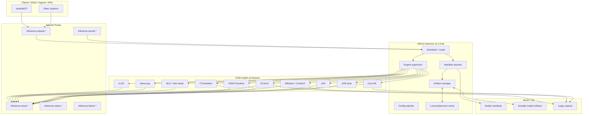
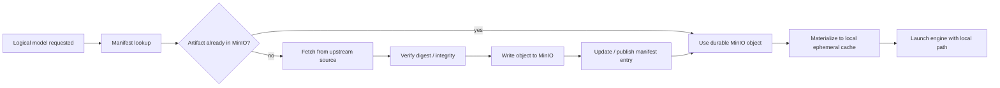
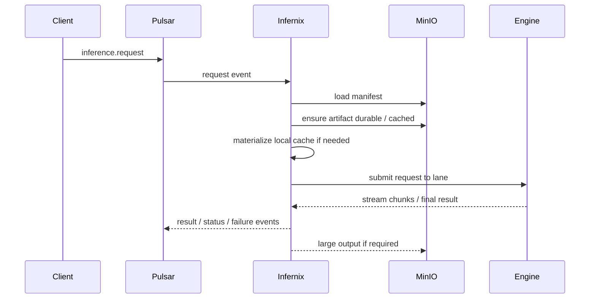
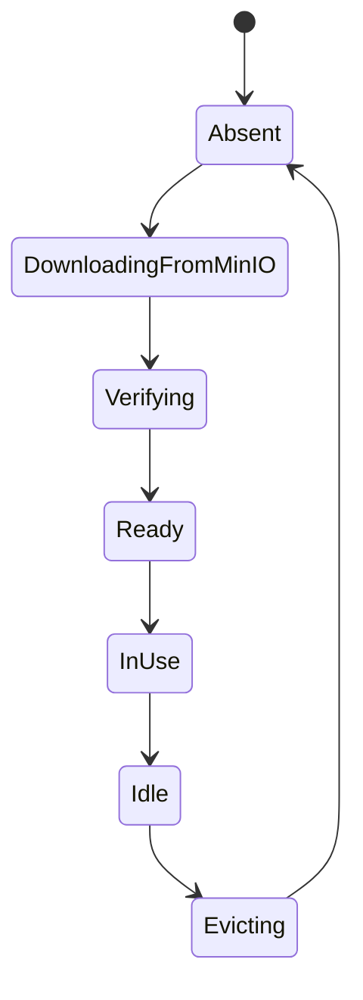

# Infernix

**Infernix** is a standalone inference supervisor and control plane.

It does not implement model execution kernels. Instead, it:

- consumes inference requests from Apache Pulsar
- validates and resolves requested logical models against a MinIO/S3-hosted model manifest
- acquires missing artifacts into MinIO idempotently when upstream sources are allowed
- materializes declared artifacts from MinIO into an ephemeral local cache
- launches and supervises runtime-specific inference engine processes
- multiplexes requests from multiple Pulsar topics into per-engine, per-model execution lanes
- returns results to Pulsar, or stores large outputs in MinIO and publishes references back to Pulsar

The design target is a single host daemon that can run in three modes:

1. **Apple Silicon / Metal**
2. **Ubuntu 24.04 / CPU**
3. **Ubuntu 24.04 / NVIDIA CUDA container**

The daemon is runtime-agnostic. Each inference engine runs in its own process and remains responsible for its own execution model, batching, memory scheduling, and backpressure. Infernix owns orchestration, model lifecycle, routing, admission control, and artifact management.

---

## Status

This README describes the intended standalone architecture derived from the design work in this conversation. It is written as a technical specification for a future FOSS project, not as a claim that every feature is already implemented.

---

## Design Goals

- **Single control plane** for heterogeneous inference stacks
- **One daemon binary per host**, with platform-specific build targets
- **Per-engine process isolation**
- **MinIO/S3 as the durable source of truth** for manifests and cached artifacts
- **Dhall as the required configuration language**
- **Hot-reloadable configuration** with safe worker drain and cache/memory reclamation
- **Event-driven request ingress and result egress via Pulsar**
- **Idempotent artifact acquisition** and **idempotent local materialization**
- **Engine-owned batching**, not parent-owned batching
- **Single-device execution as the baseline unit**: one Apple SoC, one CPU host, or one NVIDIA GPU

---

## Non-Goals

- Reimplementing token generation or diffusion kernels
- Replacing vLLM, llama.cpp, MLX, PyTorch, Diffusers, CTranslate2, or similar runtimes
- Forcing all model families into one universal runtime abstraction with identical semantics
- Treating Linux/CUDA and Apple/Metal as the same deployment substrate
- Making local ephemeral caches authoritative

---

## High-Level Topology



---

## Build Targets

## 1. Apple Silicon / Metal

### Deployment shape
- host-native macOS daemon
- no Linux VM requirement
- no Docker dependency for the inference path
- direct access to Metal and unified memory

### Intended engines
- `llama.cpp` for GGUF and whisper.cpp-family local execution
- `MLX` / `MLX-LM` for Apple-native model execution
- `vllm-metal` when a vLLM-style serving surface on Apple is desired
- `PyTorch` on MPS where no better Apple-native runtime exists
- `Core ML` where models are explicitly exported to Core ML
- `jax-metal` where JAX is the canonical execution path

### Packaging preference
- Homebrew for native binaries where available
- Poetry / pip-managed virtual environments for Python-based runtimes
- no unmanaged global Python environments

---

## 2. Ubuntu 24.04 / CPU

### Deployment shape
- native Linux binary
- suitable for test, fallback, constrained deployments, and CPU-only workloads

### Intended engines
- `llama.cpp`
- `whisper.cpp`
- `PyTorch` CPU backend
- `ONNX Runtime` CPU backend
- JVM tools such as Audiveris

### Packaging preference
- native executable build for Infernix
- distro packages or pinned venvs for engines

---

## 3. Ubuntu 24.04 / NVIDIA CUDA Container

### Deployment shape
- containerized worker
- Ubuntu 24.04 base image
- NVIDIA Container Runtime required
- one or more engine containers or engine binaries supervised inside a worker container

### Intended engines
- `vLLM`
- `PyTorch` CUDA backend
- `Diffusers` / `ComfyUI`
- `CTranslate2`
- `TensorFlow` CUDA backend where required
- `JAX/XLA` on NVIDIA where required
- `llama.cpp` when GGUF remains the right artifact/runtime choice

### Packaging preference
- OCI images
- pinned CUDA stack
- pinned Python environments inside container images

---

## Why the Build Targets Are Separate

Apple Silicon and Linux/CUDA are both first-class, but they are not the same operational environment.

- Linux/CUDA prefers containerized workers and NVIDIA runtime integration.
- Apple Silicon prefers host-native execution with Metal, MLX, Core ML, and MPS.
- CPU-only Linux remains important for testing, fallback, small models, and non-GPU media tooling.

Infernix abstracts orchestration and artifact management, not the host OS or accelerator model.

---

## Configuration

## Dhall is mandatory

A `.dhall` configuration file is required to start the daemon.

No default config is embedded in the binary. The daemon starts only if a valid Dhall configuration path is provided.

### The config must define

- Pulsar connection information
- MinIO/S3 connection information
- local cache directory and limits
- engine definitions and launch commands
- engine-to-device availability on the host
- optional upstream acquisition policy
- topic subscriptions and routing rules
- metrics and logging settings
- worker drain / reload policy

### Example Dhall shape

```dhall
{ pulsar =
    { url = "pulsar://localhost:6650"
    , tenant = "public"
    , namespace = "default"
    , auth = None Text
    }
, minio =
    { endpoint = "http://localhost:9000"
    , bucket = "infernix-models"
    , accessKeyEnv = "MINIO_ACCESS_KEY"
    , secretKeyEnv = "MINIO_SECRET_KEY"
    }
, cache =
    { root = "/var/lib/infernix/cache"
    , maxSizeGiB = 200
    , evictOnReload = True
    }
, manifests =
    { prefix = "manifests/"
    , allowUpstreamAcquisition = True
    }
, engines =
    [ { name = "vllm-qwen"
      , kind = "vllm"
      , executable = "/opt/infernix/engines/vllm-worker"
      , device = "cuda:0"
      }
    , { name = "llamacpp-local"
      , kind = "llamacpp"
      , executable = "/opt/homebrew/bin/llama-server"
      , device = "metal"
      }
    ]
}
```

### Config watch / hot reload

The daemon watches the configured file path.

On change, the daemon must:

1. parse and validate the new Dhall configuration
2. compute the effective delta
3. drain or restart affected engine workers
4. unload models that are no longer valid under the new config
5. reclaim process memory where possible
6. prune or evict local ephemeral cache entries when required by policy
7. resume ingress using the new configuration

The intent is that a config change can remove a model, remap it to a different engine, or change device allocation without requiring a full host reboot.

---

## Storage Model

## Source of truth

- **Pulsar** is the source of truth for in-flight request state
- **MinIO/S3** is the source of truth for durable manifests, durable model artifacts, and durable large outputs
- **Local disk** is only an ephemeral materialization cache

### Consequences

- local files are disposable
- local caches are reconstructible
- workers are not authoritative for model state
- artifact immutability is enforced at the object-store layer

---

## Two-Stage Artifact Flow

There are two distinct stages.

## Stage A: upstream acquisition into MinIO

The server is responsible for idempotently downloading and caching models **into MinIO** when the manifest policy allows upstream acquisition.

This means Infernix can:

- fetch from upstream registries or release URLs
- verify the download
- store the artifact under a stable content-derived object path in MinIO
- update or publish the corresponding model manifest entry
- avoid duplicate uploads when the same digest already exists

This makes MinIO the durable system-of-record cache for model artifacts.

## Stage B: local materialization from MinIO

For execution, Infernix then:

- resolves the requested logical model and artifact from the manifest
- downloads the artifact from MinIO into the local host cache if absent
- verifies checksum/digest
- launches the target engine against the local materialization

This separation matters because most engines expect file-backed artifacts, not direct object-store streams into device memory.

---

## Artifact Acquisition Flow



---

## Model Manifest

The MinIO-hosted model manifest defines the legal model surface.

It answers:

- which logical models are allowed
- which artifact variants exist
- which inference engine each artifact requires
- which device class the artifact is allocated on
- where the durable object lives in MinIO
- whether upstream acquisition is allowed

### Example manifest

```json
{
  "schemaVersion": 1,
  "model": "qwen2.5-1.5b-instruct",
  "description": "Small instruction model for testing and light workloads",
  "artifacts": [
    {
      "id": "qwen2.5-1.5b-instruct-safetensors",
      "format": "safetensors",
      "engine": "vllm",
      "deviceClass": "cuda",
      "uri": "s3://infernix-models/models/qwen2.5-1.5b-instruct/safetensors/sha256-...",
      "sha256": "...",
      "sizeBytes": 0,
      "upstream": {
        "kind": "huggingface",
        "source": "https://huggingface.co/Qwen/Qwen2.5-1.5B-Instruct"
      }
    },
    {
      "id": "qwen2.5-1.5b-instruct-gguf-q4",
      "format": "gguf",
      "engine": "llamacpp",
      "deviceClass": "metal",
      "uri": "s3://infernix-models/models/qwen2.5-1.5b-instruct/gguf/sha256-...",
      "sha256": "...",
      "sizeBytes": 0,
      "upstream": {
        "kind": "huggingface",
        "source": "https://huggingface.co/Qwen/Qwen2.5-1.5B-Instruct-GGUF"
      }
    }
  ]
}
```

### Recommended manifest fields

- `schemaVersion`
- `model`
- `description`
- `modality`
- `artifacts[]`
  - `id`
  - `format`
  - `engine`
  - `deviceClass`
  - `uri`
  - `sha256`
  - `sizeBytes`
  - `tokenizerUri` / `configUri` if relevant
  - `upstream.kind`
  - `upstream.source`
  - `notes`

### Device classes

Suggested canonical device classes:

- `cpu`
- `cuda`
- `metal`
- `mps`
- `coreml`
- `jvm`

---

## Execution Model

## Process isolation

Each inference engine runs in its own process.

Examples:

- `vllm-worker`
- `llamacpp-worker`
- `mlx-worker`
- `pytorch-worker`
- `diffusers-worker`
- `ctranslate2-worker`
- `onnx-worker`
- `coreml-worker`
- `jax-worker`
- `jvm-tool-worker`

Infernix supervises these child processes and treats them as independently restartable execution planes.

## Responsibilities owned by Infernix

- request ingestion from Pulsar
- request normalization
- manifest validation / model legality checks
- engine selection
- device-aware routing
- admission control
- cancellation propagation
- model acquisition to MinIO
- local artifact materialization
- engine lifecycle management
- hot reload / worker drain
- metrics and health checks

## Responsibilities owned by the engine

- final batching
- prefill/decode scheduling for LLMs
- diffusion scheduler execution for image/video
- tensor/kernel execution
- internal memory planning
- native backpressure behavior
- streaming token/frame/audio emission

Infernix intentionally stops at the edge of model execution.

---

## Lane Model

Requests from multiple Pulsar topics are merged into per-engine, per-model lanes.

Example lanes:

- `vllm/qwen2.5-1.5b-instruct/cuda:0`
- `llamacpp/tinyllama-gguf/metal`
- `ctranslate2/whisper-small/cuda:0`
- `pytorch/demucs/cuda:0`
- `coreml/basic-pitch/metal`

A lane owns a single real-time stream of requests for one engine/model/device combination. The engine is then free to batch those requests internally.

This preserves batching opportunities across many upstream workloads while avoiding parent-side reimplementation of runtime-specific schedulers.

---

## Request Flow



---

## Messaging

Suggested topic families:

- `inference.request.*`
- `inference.cancel.*`
- `inference.result.*`
- `inference.status.*`
- `inference.failure.*`
- `inference.control.*`

### Message keys

Use stable keys such as:

- `conversation_id`
- `job_id`
- `request_id`

This allows ordered-per-key routing with parallelism across unrelated keys.

### Result routing

- small results: publish directly to Pulsar
- large results: write to MinIO, then publish a reference event

---

## Idempotency

## Model acquisition into MinIO

Artifact acquisition must be idempotent.

If the same upstream object has already been acquired and stored under the same digest-derived MinIO path, a repeated acquisition request must be a no-op.

## Local materialization

If the same artifact already exists in the local cache under the same digest and has passed integrity checks, materialization must be a no-op.

## Request handling

At-least-once delivery from Pulsar is assumed. Infernix should therefore treat request handling as replayable and use request IDs to suppress duplicate effectful result publication when required.

---

## Local Cache Lifecycle



### Cache properties

- ephemeral
- content-addressed where possible
- size-limited
- safe to delete
- reconstructible from MinIO

### Recommended cache path convention

`<cache-root>/<artifact-digest>/...`

This makes cache reuse, corruption detection, and eviction simpler.

---

## Why direct object-store to device-memory loading is not the baseline

In principle, some specialized runtimes can stream directly into host or device memory.

In practice, most of the engines Infernix needs to supervise expect file-backed artifacts, support memory mapping or staged loading, and benefit operationally from a local file layer.

Therefore the baseline design is:

- upstream → MinIO durable cache
- MinIO → local ephemeral file cache
- local file cache → engine memory

This keeps MinIO authoritative while preserving compatibility with real runtimes.

---

## Packaging Strategy

## Apple Silicon

Preferred approach:

- Homebrew for native binaries such as `llama.cpp`
- Poetry / pip-managed virtual environments for MLX, vllm-metal, PyTorch-on-MPS, and similar Python runtimes

## Ubuntu CPU

Preferred approach:

- native Infernix binary
- distro packages or pinned venvs for auxiliary engines

## Ubuntu CUDA

Preferred approach:

- OCI containers
- pinned CUDA toolkit and Python environment per image

---

## Comprehensive Model / Format / Engine Matrix

This table is the practical execution matrix for the model families and artifact formats discussed in this conversation.

| Model / workload type | Artifact / format type | Reference model (small where practical) | Download URL | Best Linux CPU engine | Best Linux CUDA engine | Best Apple Silicon engine | Notes |
|---|---|---|---|---|---|---|---|
| LLM (general text) | HF safetensors | Qwen2.5-1.5B-Instruct | https://huggingface.co/Qwen/Qwen2.5-1.5B-Instruct | Transformers + PyTorch CPU | vLLM | Transformers + PyTorch MPS | Canonical source format for many open-weight LLMs |
| LLM (quantized, CUDA-focused) | AWQ | Qwen2.5-1.5B-Instruct-AWQ | https://huggingface.co/Qwen/Qwen2.5-1.5B-Instruct-AWQ | Not recommended | vLLM | Not recommended | GPU-oriented quantized checkpoint |
| LLM (quantized, CUDA-focused) | GPTQ | TinyLlama-1.1B-Chat-v1.0-GPTQ | https://huggingface.co/TheBloke/TinyLlama-1.1B-Chat-v1.0-GPTQ | Not recommended | vLLM | Not recommended | Older but still useful quantized checkpoint family |
| LLM (local / edge) | GGUF | TinyLlama-1.1B-Chat-v1.0-GGUF | https://huggingface.co/TheBloke/TinyLlama-1.1B-Chat-v1.0-GGUF | llama.cpp | llama.cpp | llama.cpp (Metal) | Best cross-platform local runtime path |
| LLM (Apple-native) | MLX | Qwen1.5-1.8B-Chat-4bit (MLX) | https://huggingface.co/mlx-community/Qwen1.5-1.8B-Chat-4bit | Not recommended | Not recommended | MLX / MLX-LM | Apple-native converted artifact family |
| Speech transcription | whisper.cpp model set / GGML-style | whisper-small | https://github.com/ggml-org/whisper.cpp/tree/master/models | whisper.cpp | whisper.cpp (CUDA if built that way) | whisper.cpp (Metal) | Best compact/native path |
| Speech transcription | CTranslate2 | faster-whisper-small | https://huggingface.co/Systran/faster-whisper-small | CTranslate2 | CTranslate2 | Not recommended | Best throughput-oriented Whisper server path on CUDA |
| Source separation | PyTorch checkpoint | htdemucs | https://github.com/facebookresearch/demucs | PyTorch CPU | PyTorch CUDA | PyTorch MPS | Canonical Demucs execution path |
| Source separation | PyTorch checkpoint | Open-Unmix | https://github.com/sigsep/open-unmix-pytorch | PyTorch CPU | PyTorch CUDA | PyTorch MPS | Research / alternate separation path |
| Audio-to-MIDI / pitch transcription | TensorFlow model family | basic-pitch | https://github.com/spotify/basic-pitch | TensorFlow CPU or default package runtime | TensorFlow CUDA | Not recommended | TensorFlow is the preferred production lane when used on CUDA |
| Audio-to-MIDI / pitch transcription | Core ML | basic-pitch | https://github.com/spotify/basic-pitch | Not recommended | Not recommended | Core ML | Preferred Apple production lane for Basic Pitch |
| Audio-to-MIDI / pitch transcription | ONNX | basic-pitch release artifacts | https://github.com/spotify/basic-pitch/releases | ONNX Runtime CPU | ONNX Runtime CUDA | ONNX Runtime | Useful portable fallback artifact |
| Multi-instrument music transcription | JAX checkpoint / codebase | MT3 | https://github.com/magenta/mt3 | JAX CPU | JAX/XLA on NVIDIA | jax-metal | JAX is the canonical execution model |
| Music transcription / MIR family | TensorFlow model family | Omnizart | https://github.com/Music-and-Culture-Technology-Lab/omnizart | TensorFlow CPU | TensorFlow CUDA | Core ML (exported path owned by deployment) | Apple support likely requires owned export path |
| Image generation | Diffusers / safetensors pipeline | SDXL Turbo | https://huggingface.co/stabilityai/sdxl-turbo | Not recommended | Diffusers or ComfyUI | Diffusers on MPS | Standard open image-generation stack |
| Image generation | Core ML | Apple Stable Diffusion conversion toolchain | https://github.com/apple/ml-stable-diffusion | Not recommended | Not recommended | Core ML | Best Apple-native exported path when available |
| Video generation | Diffusers / safetensors pipeline | Wan2.1-T2V-1.3B | https://huggingface.co/Wan-AI/Wan2.1-T2V-1.3B | Not recommended | Diffusers / ComfyUI | Diffusers on MPS (if viable) | Smallish reference text-to-video model |
| Audio generation / TTS-style | PyTorch / HF | bark-small | https://huggingface.co/suno/bark-small | PyTorch CPU | PyTorch CUDA | PyTorch MPS | Representative audio-generation family |
| OMR / notation extraction tool | JVM application | Audiveris | https://github.com/Audiveris/audiveris | JVM | JVM | JVM | Treat as tool runtime, not a separately managed ANN kernel family |

---

## LLM Artifact Family Coverage

The previous table lists executable reference models. This table adds the LLM artifact families that matter architecturally, including formats that are not always represented by a single canonical “small model” repository.

| LLM artifact family | Standalone executable artifact? | Typical role in Infernix | Linux CPU | Linux CUDA | Apple Silicon | Notes |
|---|---|---|---|---|---|---|
| safetensors | Yes | Canonical durable source artifact | Transformers + PyTorch CPU | vLLM | Transformers + PyTorch MPS | The most important base format to support |
| AWQ | Yes | CUDA-optimized quantized checkpoint | No | vLLM | No | Best thought of as a CUDA lane |
| GPTQ | Yes | CUDA-optimized quantized checkpoint | No | vLLM | No | Similar role to AWQ |
| GGUF | Yes | llama.cpp-native deployment artifact | llama.cpp | llama.cpp | llama.cpp | Primary local / edge / Apple-native LLM format |
| MLX | Yes | Apple-native converted artifact | No | No | MLX / MLX-LM | Preferred Apple-specific artifact when available |
| LoRA / PEFT adapters | Usually no (adapter-only) | Overlay on top of base model | Engine-specific | Engine-specific | Engine-specific | Keep as separate artifact class in manifests |
| TensorRT / compiled engine builds | Sometimes | Precompiled NVIDIA-serving artifact | No | TensorRT-based workers | No | Optional future extension, not required for v1 |
| bitsandbytes-style runtime quantization | Usually no (runtime config) | Runtime-side quantization mode | Rarely ideal | Engine/runtime-specific | Rarely ideal | Better modeled as execution policy than manifest artifact |

---

## Minimal Engine Set vs. Full Engine Set

## Minimal v1 engine set

If the project starts LLM-first and adds other modalities later, a realistic v1 engine set is:

- `vLLM`
- `llama.cpp`
- `MLX`
- `whisper.cpp`
- `CTranslate2`

## More complete engine set

To cover the broader model matrix in this README, Infernix eventually needs:

- `vLLM`
- `llama.cpp`
- `MLX` / `MLX-LM`
- `vllm-metal` (optional Apple serving path)
- `PyTorch`
- `Diffusers` / `ComfyUI`
- `CTranslate2`
- `ONNX Runtime`
- `Core ML`
- `TensorFlow`
- `JAX`
- `JVM tool adapter`

This is why Infernix is a control plane rather than a single inference runtime.

---

## Why vLLM and llama.cpp are not enough for every workload

They are sufficient for many LLM use cases, and whisper.cpp overlaps with some ASR workflows, but they do not cover the full matrix.

You still need different runtime families for:

- source separation (`PyTorch`)
- diffusion image/video generation (`Diffusers`, `ComfyUI`)
- Core ML deployment lanes (`Core ML`)
- JAX-native models (`MT3`)
- TensorFlow-native model families (`Basic Pitch`, `Omnizart`)
- JVM-hosted tools (`Audiveris`)

The architecture must therefore be multi-engine from the beginning.

---

## Suggested Repository Layout

```text
infernix/
  app/
    infernix-main/
  src/
    Infernix/
      Config/
      Pulsar/
      Minio/
      Manifest/
      Cache/
      Scheduler/
      Routing/
      Engine/
      Metrics/
  engines/
    vllm/
    llamacpp/
    mlx/
    pytorch/
    diffusers/
    ctranslate2/
    onnx/
    coreml/
    jax/
    jvm/
  examples/
    config/
    manifests/
  docs/
    architecture/
    operations/
    reference/
  docker/
    cpu/
    cuda/
```

---

## Summary

Infernix is a standalone inference supervisor that fully powers inference needs by combining:

- Pulsar for in-flight request and result movement
- MinIO/S3 for durable manifests and artifacts
- Dhall for required, reloadable configuration
- per-engine process isolation
- host-specific build targets
- idempotent acquisition into MinIO
- idempotent local materialization from MinIO
- engine-owned execution and batching

The architectural rule is simple:

- **Infernix decides what should run, where, and with which artifact**
- **the child runtime decides how to execute it**

